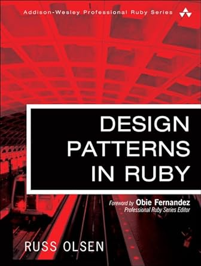
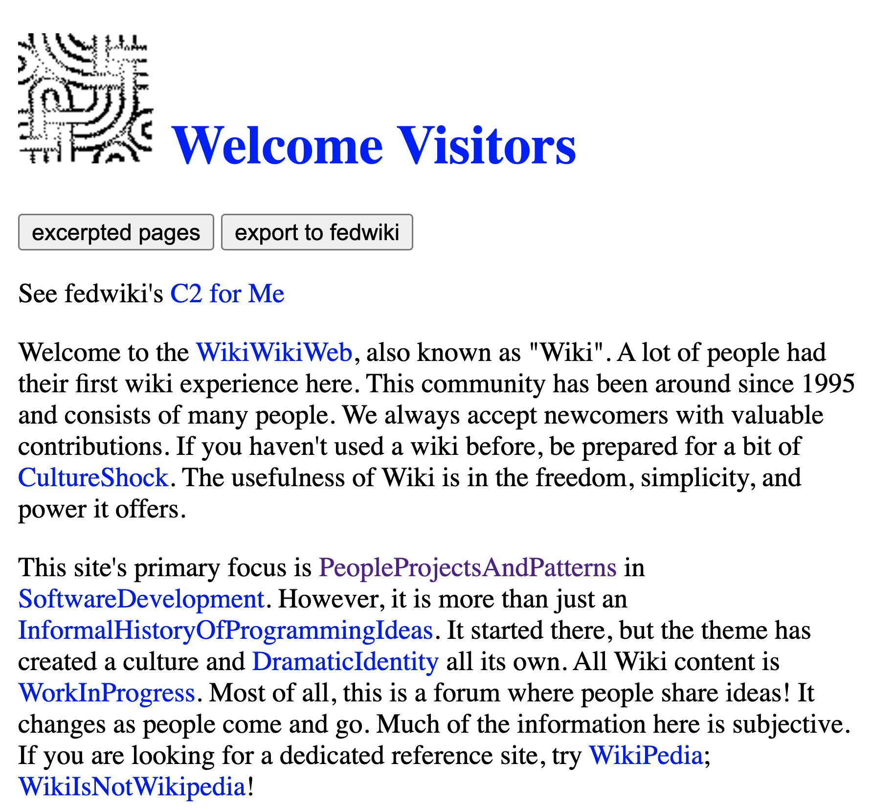
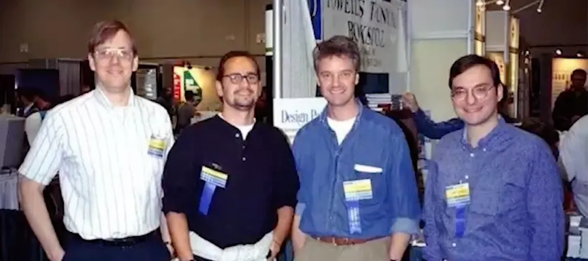
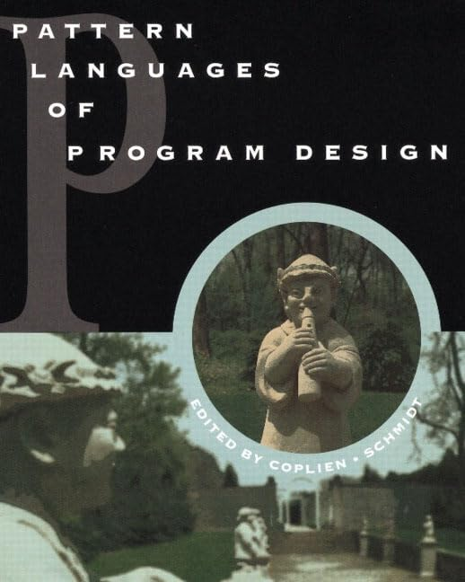
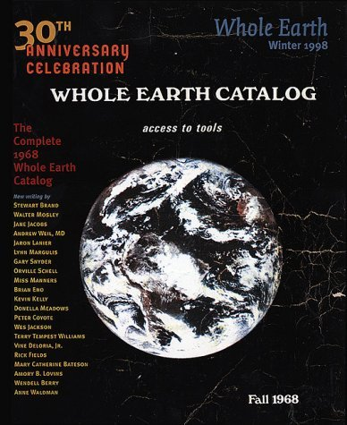

layout: true

<header>
  
Madison Ruby+ 2024

  
@CraigBuchek

</header>

<footer>
  
<!-- page numbers -->

  
http://craigbuchek.com/arch

</footer>

---
class: title, middle, center

# Architecture

# Big and Small

???

- Hi, I'm Craig
    - I'm going to talk about "architecture", "design", and "patterns"
- If you want to "at" me, ...
    - I'm on Twitter and ruby.social Mastodon
        - ... infrequently
- I have a short URL for the slides in the lower right.
    - Follow along, or look at them later
    - Hit `P` to toggle presenter notes
        - Links to resources
        - Details I don't have time to cover

---
class: single-image

???

- AUDIENCE QUESTION: Who is familiar with this book?

---
class: single-image

???

- AUDIENCE QUESTION: Who remembers that there was a companion CD you could buy?

---
class: single-image

???

- AUDIENCE QUESTION: Anyone familiar with the Ruby version?

---
class: single-image

???

- AUDIENCE QUESTION: Is anyone familiar with *this* book?

---
class: single-image

???

- This is actually part of a series
    - A Pattern Language (1977, vol 2)
        - We'll focus on this book

    - The Timeless Way of Building (1979, vol 1)
        - goes hand-in-hand with the Pattern Language book
        - philosophical approach to architecture
        - introduces the concept of the "quality without a name"
            - we should seek to include this nameless quality in our buildings
    - The Oregon Experiment (1975, vol 3)
        - experimental approach to campus community planning
            - University of Oregon
            - testbed for ideas in the later 2 books
        - People centric
            - "feeling" should be the primary criterion used for making changes to any place
            - people can and should be involved in the design process of their spaces
        - resulted in a theory of architecture and planning

---
class: single-image

???

- Earlier works:
    - Notes on the Synthesis of Form (1964)

- Christopher Alexander
    - Designed and personally built over 100 buildings
        - both as an architect and a general contractor
    - Austrian-born British-American
        - UC Berkeley
    - architect and design theorist
    - Died in 2022 (age 85)
- [The Nature of Order](https://en.wikipedia.org/wiki/The_Nature_of_Order) (2002-2004)
    - 4 books on architecture, urban design, and the nature of beauty
    - seems to be 12 books in the series now

- https://wiki.c2.com/?ChristopherAlexander

---

# Pattern Languages

- Collection of patterns
- Describes problems and solutions
- Organized
- Coherent
- Specific field of expertise

???

- 

---
class: single-image

???

- Ward Cunningham:
    - Invented the Wiki (1995)
    - Extreme Programming (XP)
    - FIT (Framework for Integrated Test)
    - Smalltalk
    - Eclipse Foundation
    - Agile Manifesto
    - Coined "Technical Debt" (1992)
    - Class-responsibility-collaboration (CRC) cards
    - Federated Wiki
    - Cunningham's Law
        - "The best way to get the right answer on the internet is not to ask a question; it's to post the wrong answer."

- Ward and Beck - Graphical User Interfaces in Smalltalk book in 1987
    - Based on Christopher Alexander's work
    - https://wiki.c2.com/?WardAndKent

---
class: single-image

???

- Kent Beck:
    - Apple
    - Extreme Programming (XP)
    - Test-Driven Development (TDD)
    - Agile Manifesto
    - Smalltalk
        - Smalltalk Best Practice Patterns
    - JUnit
    - "Make it work, make it right, make it fast"

---
# History of Design Patterns

- TODO: Picture here instead of text

???

- Prior to the GoF book, there was a community of people who were already using patterns
    - Ward Cunningham
    - Kent Beck
    - Martin Fowler
    - Ron Jeffries
    - Ralph Johnson
    - Erich Gamma
    - Richard Helm
    - John Vlissides
    - Grady Booch
    - James Coplien
    - Joshua Kerievsky
    - Michael Feathers

---
class: single-image

???

- The first wiki led directly from Alexander's work, according Ward Cunningham
- Ward and Kent probably found Alexander's work via Edward Yourdon

- C2 Wiki
    - C2 = Cunningham & Cunningham, Inc
    - Design Patterns
    - Portland Pattern Repository (PPR)
        - People, Projects, Patterns
        - Ward Cunningham lives near Portland, Oregon

---

---
class: single-image

???

- This is **the** software Design Patterns book
- AKA the Gang of Four (GoF) book
- Written by Erich Gamma et al

- Covers 23 patterns
    - Mostly in Java and C++
    - But the patterns are language-agnostic

------

- https://wiki.c2.com/?GangOfFour

---
class: single-image

???

- Erich Gamma:
    - Swiss computer scientist
    - 1988, started PhD 
        - applying general idea of design patterns to software engineering
    - co-authored JUnit with Kent Beck
    - IBM Rational Jazz
    - Eclipse IDE (successor to Visual Age)
    - Visual Studio Code
- https://wiki.c2.com/?ErichGamma

---
class: single-image

???

- Richard Helm:
    - Australian software engineer and consultant
    - software architecture
    - object-oriented design
    - IT Strategy and IT transformation
- https://wiki.c2.com/?RichardHelm

---
class: single-image

???

- Ralph Johnson:
    - American computer scientist
    - professor emeritus at the University of Illinois at Urbana-Champaign
    - Major contributor to the development of object-oriented programming and Smalltalk
- https://wiki.c2.com/?RalphJohnson

---
class: single-image

???

- John Vlissides: 
    - American software engineer and researcher
    - Stanford University & IBM Watson Research Center
        - software design and development
        - software visualization modeling tools and techniques
        - software design tools and techniques (especially object-oriented ones)
        - application frameworks and builders
        - tools for UI development
            - Interviews (competitor to X11)
- https://wiki.c2.com/?JohnVlissides

---
class: single-image

???

- Grady Booch:
    - Forward of the GoF book
    - Object Analysis and Design with Applications (1993 book)
        - Booch Method
        - Coined the term "object-oriented design"?
    - Unified Modeling Language (UML)
    - IBM Rational
    - Rational Unified Process (RUP)
        - AKA Unified Software Development Process (USDP)
            - Book: The Unified Software Development Process
        - Software development process
        - Use-case driven
        - Architecture-centric
        - Iterative and incremental
    - IBM Research - Almaden
        - Chief Scientist for Software Engineering
        - "Handbook of Software Architecture"

- My apologies to Grady Booch for having taken the `booch` username on GitHub

------

- https://wiki.c2.com/?GradyBooch

---
class: single-image

???

- Jim Coplien, 1995
    - I knew him from his book on C++
        - Advanced C++ Programming Styles and Idioms
- Also a conference:
    - Pattern Languages of Programs, 1994-present
    - PLoP
    - Hillside Group

"A pattern language is an organized and coherent set of patterns, each of which describes a problem and the core of a solution that can be used in many ways within a specific field of expertise." - Wikipedia

---
class: single-image

???

- IMHO, one of the best books on Ruby
- Released in 1996
    - Nearly pre-dates Ruby!
- Covers a lot of smaller patterns

- TODO: Smaller pattern examples

---

class: single-image

???

- Martin Fowler:
    - Chief Scientist, Thoughtworks
    - Refactoring book (1999, with Kent Beck)
    - Patterns of Enterprise Application Architecture (2002)
    - Agile Manifesto
    - UML Distilled (1997)
    - Domain-Specific Languages book (2010)
    - Continuous Integration
    - Microservices
    - Domain-Specific Languages

---
class: single-image

???

- Patterns of Enterprise Application Architecture (2002)
    - Martin Fowler
    - 42 patterns
- More patterns, targeted at larger systems
- https://martinfowler.com/eaaCatalog/
- DHH learned patterns that he applied to Ruby on Rails
    - Active Record
    - Model-View-Controller

---

# Software Design Pattern

- General solution to a common problem
- Not an algorithm
- Not code
- Blue-print of the outline of a solution

???

- Not code - cannot be copied and pasted
- Not an algorithm - not that specific

---

# Software Design Pattern

- Name
- Intent
- Context
- Problem
- Solution
- Cross-references

???

- Patterns help us use a common language to describe solutions to common problems
- Intent: What are we trying to accomplish?
- Context: Conditions under which the pattern holds
- Problem: "System of forces" that leads towards some goal
- Solution: configuration that balances the system of forces

---

# Software Design Pattern - Examples

- Singleton
- Factory
- Strategy
- Template Method
- Visitor
- Null Object

???

- A singleton is a class that can only be instantiated once
- A factory is a class or method that creates objects
- A strategy is a class that provides an algorithm that can be swapped out
- A template method provides a default implementation that can be overridden
- A visitor is used to iterate over a collection of objects
- A null object is used to provide a default implementation that does nothing

---

# Software Design Pattern - Example

- [Null Object](https://sourcemaking.com/design_patterns/null_object)

---

# Software Design Pattern Categories

- Creational
- Structural
- Behavioral
- Concurrency
- Architectural

???

- Creational patterns create objects
- Structural patterns organize classes and objects to form larger structures
- Behavioral patterns provide communication between objects
- Concurrency patterns deal with multi-threading
- Architectural patterns deal with high-level structure

---

# Software Design Patterns - Criticism

- Overuse
- Wrong context
- Limited reusability
- Missing language features
- Paradigm-specific
- Not a substitute for experience
- Not a silver bullet

???

- The first problem is that many developers misunderstand patterns
    - They try to take patterns and apply them to every problem
    - Instead, we need to think of patterns as a common language to describe solutions to common problems
    - Patterns can be very context-dependent
- Reuse often isn't possible
    - We have to write the pattern every time
    - Components are a better way to reuse code
- Many patterns are just a replacement for missing language features
    - For example, in machine language, a "subroutine" was a pattern
    - In Ruby, we have `Enumerable`, so we don't need the Iterator or Visitor pattern as much
    - In Ruby, mixins are just part of the language, so we don't think of them as a pattern
    - In Ruby, dependency injection just feels like passing in a parameter (with a default)
- Most of the patterns in the GoF book are object-oriented
- And of course, patterns are not a substitute for experience

---

# Missing Language Features

~~~ java
Iterator it = nodes.iterator();
while (it.hasNext()) {
    Node node = (Node) it.next();
    node.doSomething();
}
~~~

~~~ ruby
nodes.each { |node| node.doSomething }
~~~

???

------

- https://wiki.c2.com/?DesignPatternsAreMissingLanguageFeatures

---
class: single-image

???

- I missed something in my chronology
    - I was well into writing this talk before my research turned it up
    - I had seen mention of the book recently
        - An article about it (or maybe a video)
        - Definitely after I had proposed this talk
            - But I didn't think much about it in relation to this talk
- How Buildings Learn: What Happens After They’re Built (1994)
    - Stewart Brand
        - Whole Earth Catalog
        - Long Now Foundation
            - 10,000-year clock
            - 10,000-year Library
            - Long Bets
- Inspired by Alexander's work
    - Extensive work with Christopher Alexander
- 6-part TV series for the BBC
    - Aired in July-August 1997 on BBC2
- the best buildings are made from low-cost, standard designs that people are familiar with, and easy to modify
- "Use materials that smell bad when they are wet"
    - So you know when there's a leak

---
class: single-image

???

- Stewart Brand, 1968-1972
- Stewart Brand
    - LSD studies (legal, early 1960s)
    - helped design and participated in Doug Engelbart's "mother of all demoes” (1968)
    - The Well (Whole Earth 'Lectronic Link) (1984) - first online community
    - Stanford
    - MIT Media Lab
    - coined the term "personal computer"?
        - first use of the term “personal computer” in print (1974) - Two Cybernetic Frontiers
    - director of the Electronic Frontier Foundation (EFF) (1990-1994)
    - Founded (with Danny Hillis) the Long Now Foundation (1995)
        - 10,000 year clock
        - 10,000-year Library
        - also Brian Eno, Esther Dyson
        - Long Bets
    
------

 - “Why Haven’t We Seen A Photograph of the Whole Earth Yet?” (1966)
    - Legend has it that this accelerated NASA's making good color photos of Earth from space
        - The ecology movement took shape in 1970 partially as a result of those photos
    - https://sb.longnow.org/SB_homepage/WholeEarth_buton.html

---
class: single-image

???

- **This all applies to software as well!**
    - Incremental change
    - Learning as you go
    - Choose the option that gives more options in the future
    - Adaptation to changing needs
    - "Maintenance is a form of evolution"
    - Buildings are predictions
        - All predictions are wrong
        - Ergo, design so that it doesn't matter when they're wrong
    - A building is never finished
    - [Shearing layers](https://en.wikipedia.org/wiki/Shearing_layers)
        - SITE: changes every 50-500 years
        - STRUCTURE: foundation & load-bearing, rarely changed
        - SKIN: changes every 20 years, air-tight, better insulated
        - SERVICES: changes every 7-15 years
        - SPACE PLAN: interior layout, walls, ceilings, floors, doors. changes every 3-30 years
        - STUFF: "mobilia" in Italian

---
class: single-image

???

- We shape our buildings, and our buildings shape us
    - Adaptation between buildings and users is slow and continuous process
- Over 50 years, the changes within a building cost more than the original building
    - 3x more for a commercial building
    - 6x more for a residential building
- Hire good builders and save money in the long run
- "temporary" is permanent most of the time
- Fail small, early, and often, and you will succeed in the long run

- "A new building is a bad teacher of maintenance habits, since deferring of maintenance is habit. A building that has been maintained for a long time is a good teacher, since its maintenance is a habit."

- In many fields, "architecture" means "unchanging deep structure".

- TODO: More!

---
# Large vs Small

???

- We think of architecture as "big"
    - Buildings
    - Cities
    - Software systems
- But we can also think of "small" architecture
    - Rooms
    - Software components

---
class: single-image

???

- I was surprised that Alexander's book didn't cover this
- Door knobs are a relatively recent invention
    - 1878
    - Lever handles are much older
- I found 2 web pages that help choose which to use
    - Knobs have more styles available
    - Knobs can turn either way
    - Levers are easier to use
    - Levers can be used with your hands are full
    - Levers are easier for young people, old people, disabled people
    - Levers can easily snag on clothing

------

- https://www.suffolklatchcompany.com/blogs/news/door-knobs-or-door-handles
- https://www.parkavenuelocks.com/blog/post/door-knobs-vs-door-levers-ending-the-debate

---
class: single-image

???

- We rarely think of a button as an architectural element
- But an architectural element is anything that is part of the structure of an application
        - or building
- We should choose the right button for the right context
    - We should not have a "one-size-fits-all" button
    - But we should not have every button be different

---

# Conclusions

- Patterns are a way to describe solutions to common problems
- Pattern languages give us a common language
- Architecture is about structure
- We can't predict what our future needs will be
    - So we need to design for change, evolution, and adaptation
    - Learning, habit, prediction, 
    - The majority of the costs are in maintenance 
- Architecture is about people
    - How they interact with a space or a software application

???

- TODO

---

# Resources

- [Source Making](https://sourcemaking.com/design_patterns)
- [Hillside Group](https://hillside.net/patterns/)
- [Martin Fowler's Software Architecture Guide](https://martinfowler.com/architecture/)
- [Wikipedia - Pattern Language](https://en.wikipedia.org/wiki/Pattern_language)
- [Wikipedia - Software Design Pattern](https://en.wikipedia.org/wiki/Software_design_pattern)
- [Using Pattern Languages for Object-Oriented Programs](https://c2.com/doc/oopsla87.html)
    - First paper on patterns in software

???

- There are a couple really good sites on Design Patterns
- Source Making is one of the best
    - It's also great for info on refactoring and anti-patterns
    - [Refactoring Guru](https://refactoring.guru/design-patterns) seems to be the same site
        - But different

(more on next slide)

---

# Resources

- [Design Patterns Reconsidered - Alex Miller](https://puredanger.github.io/tech.puredanger.com/2008/06/29/javaone-2008-design-patterns-reconsidered/)
- [Christopher Alexander: An Introduction for Object-Oriented Designers - Doug Lea](https://gee.cs.oswego.edu/dl/ca/ca/ca.html)
- [Patterns-Discussion FAQ](https://gee.cs.oswego.edu/dl/pd-FAQ/pd-FAQ.html)
- [PatternLanguage.com](https://www.patternlanguage.com/)
- [Awesome Design Patterns](https://github.com/DovAmir/awesome-design-patterns)

---

# Resources

- A few patterns that I found independently and documented:
    - [Debugging Pattern – Grenade](https://web.archive.org/web/20161107180216/http://blog.boochtek.com/2012/01/11/grenade-debugging-pattern)
    - [Readable Shell Scripts](https://web.archive.org/web/20210510214107/http://blog.boochtek.com/2014/03/11/readable-shell-scripts)
    - [Ruby Pattern: Parameterized Module Inclusion](https://web.archive.org/web/20210510205350/http://blog.boochtek.com/2014/04/14/ruby-parameterized-module-inclusion)

---

# Open to Opportunities

* Principal Software Engineer

* Ruby: 18 years
* Devops: 11 years
* Network Security: 7 years
* Agile: 15 years

* Resume: https://resume.craigbuchek.com

???

* I'm currently looking for my next great opportunity

---
class: thanks, image-only

# Thanks

???

- Thank YOU for coming.

------

- Thanks to Madison Ruby for selecting my talk
- Members of STL Linux meetup for feedback on a preview of the talk

---

# Feedback

- GitHub: [booch][github]
- Mastadon: [@CraigBuchek@ruby.social][mastadon]
- Twitter: [@CraigBuchek][twitter]
- Email: craig.buchek@gmail.com
- LinkedIn: https://www.linkedin.com/in/craigbuchek
- Resume: https://resume.craigbuchek.com

- Slides: http://craigbuchek.com/arch
    - Source: https://github.com/booch/presentations

???

- One reason I give talks at conferences is to start a conversation.
- Please don't hesitate to come talk to me.

------

- I used a tool called [Remark][remark] to create and show these slides.

[github]: https://github.com/booch
[mastadon]: https://ruby.social/@CraigBuchek
[twitter]: https://twitter.com/CraigBuchek
[remark]: http://remarkjs.com/

---

# Image Credits

- 
