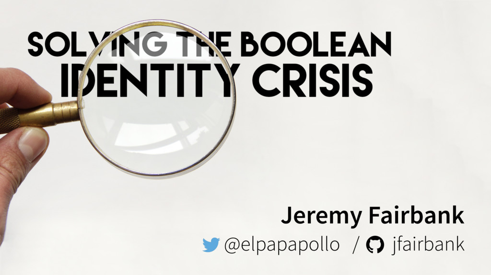

layout: true

<header>
  
RailsConf - 2018-04-17

  
@CraigBuchek

</header>

<footer>
  
<!-- page numbers -->

  
http://craigbuchek.com/booleans

</footer>

---
class: title, middle, center

# Booleans are Easy:
# True or False?
### Craig Buchek

---
class: middle

* Slides: http://craigbuchek.com/booleans

* Hit `P` to toggle presenter notes
    * References
    * More details than I will talk about

???

* If you want to follow along, or see the slides later, here's the URL.
    * It'll be in the lower right corner.
* Hit `P` for presenter notes.
    * Notes have links to things I reference.
    * Notes have more info than I'll talk about in some cases.
* My Twitter is in the upper right corner if you want to tweet at/about me.

---
class: middle, center, image-only

???

* I live in St. Louis.

---
class: middle, center, image-only

???

* So I can go to Strange Loop without traveling.
* I went last year.

------

* Strange Loop is a great conference.
    * Lots of things will be over your head.
    * It's inspirational to see all the advanced things going on.

---
class: middle, center, image-only, percent-70

???

* My favorite talk was on the pre-conference day, at Elm-Conf.

---
class: middle, center, image-only

???

* It was a talk on Booleans by Jeremy Fairbank.
* That talk inspired me to create this talk.
* Ruby is very different than Elm, so this talk is very different from Jeremy's.
* I highly recommend watching Jeremy's talk.

------

* Jeremy's video: [Solving the Boolean Identity Crisis by Jeremy Fairbank](https://www.youtube.com/watch?v=8Af1bh-BVY8)
* Jeremy's slides: [Slides for "Solving the Boolean Identity Crisis"](https://bit.ly/elm-bool)

---
class: transition, boolean_basics

# Boolean Basics

???

* On to Ruby!

---

# Boolean Basics

~~~ ruby
a = true
b = false
~~~

???

* Booleans are pretty simple, right?
* The value of a Boolean is either true or false.

---

# Boolean Basics

~~~ ruby
a = true
a.class
# => TrueClass

b = false
b.class
# => FalseClass
~~~

???

* `true` and `false` are instances of classes named `TrueClass` and `FalseClass`.

---

# Boolean Basics

~~~ ruby
a = true
a.object_id
# => 20

c = true
c.object_id
# => 20

( 1 + 1 == 2 ).object_id
# => 20
~~~

???

* In fact, there's only 1 instance of each.
* No matter how we get `true`, it's always the same object.

------

* From the `object_id` documentation: "no two objects will share an id".

---

# Boolean Basics

~~~ ruby
TrueClass.new
# => NoMethodError: undefined method `new' for TrueClass:Class

FalseClass.new
# => NoMethodError: undefined method `new' for FalseClass:Class
~~~

???

* You can't create a new instance of these classes.

---

# Boolean Basics

~~~ ruby
Boolean
# => NameError: uninitialized constant Boolean

TrueClass.ancestors
# => [TrueClass, Object, Kernel, BasicObject]
~~~

???

* Interestingly, there's no Boolean class in Ruby.
* This is apparently due to Ruby's Smalltalk heritage.

------

* This is partially because Ruby is dynamically typed.
    * There's no need to declare a variable as a Boolean.

---

# Boolean Basics

~~~ ruby
"this is true" if true
# => "this is true"

"123 acts like it's true" if 123
# => "123 acts like it's true"

"this object acts like it's true" if Object.new
# => "this object acts like it's true"

"this is false" unless false
# => "this is false"

"nil acts like it's false" unless nil
# => "nil acts like it's false"
~~~

???

* Anywhere Ruby expects a Boolean, you can use any object.
* Ruby treats `false` and `nil` as false.
    * Everything else is treated as true.
* You might hear the terms "truthy" and "falsey".
    * They express something that Ruby will interpret as true or false in this context.

---

# Boolean Basics

~~~ ruby
expect(123).to be_truthy

expect(subject.valid?).to be_falsey
~~~

???

* You might come across those terms ("truthy" and "falsey") in RSpec tests.

---

# Boolean Basics

~~~ ruby
"string is empty" if string.empty?
"string is blank" if string.blank?

"variable is nil" if variable.nil?
~~~

???

* But it's not recommended to rely on that in `if` statements.
* It's better to use something more intention-revealing that returns a Boolean.

------

* This isn't as big a problem in Ruby as in other languages.
    * Perl, PHP, and JavaScript interpret empty strings and 0 as `false`.
* I contend that automatic coercion to Booleans are the 2nd most expensive mistake in computer language design.
    * The most expensive mistake is null pointers (leading to null pointer exceptions).
        * See [Null References: The Billion Dollar Mistake](https://www.infoq.com/presentations/Null-References-The-Billion-Dollar-Mistake-Tony-Hoare)

---
class: transition, boolean_parameters

# Boolean Parameters

???

* Next we'll talk about Booleans used as parameters to methods.

---

# Boolean Parameters

~~~ ruby
random_object.class
# => User
~~~

???

* I spend a lot of time in Rails console, IRB, or Pry.
* I'll often want to see the class of an object.

------

* I actually wrote a method to get a random object:

~~~ ruby
def random_object(cache: true)
  return @random_object if cache && @random_object_defined
  @random_object_defined = true
  random_object_index = Random.rand(ObjectSpace.each_object.count)
  @random_object = ObjectSpace.each_object.drop(random_object_index).take(1)
end
~~~

---

# Boolean Parameters

~~~ ruby
random_object.methods
# => [:can?, :cannot?, :paper_trail_originator, :paper_trail_enabled_for_model?, :whodunnit]

random_object.class.instance_methods
# => [:can?, :cannot?, :paper_trail_originator, :paper_trail_enabled_for_model?, :whodunnit]
~~~

???

* Often, I'll also want to see what methods the object can respond to.
* I'll use a method that's on `Object`, named `methods`.
    * Or a method that's on `Class`, named `instance_methods`.
* Notice that these usually return a long list of methods.
    * They're running off the right side of the text box here.
* Show of hands - who's familiar with either of these methods?
* How many of you (with your hands up) know that they take an optional parameter?
* How many of you remember whether to pass `true` or `false` to not show methods from superclasses?

---

# Boolean Parameters

~~~ ruby
random_object.methods(false)
# => [:id, :first_name, :last_name]

random_object.class.instance_methods(false)
# => [:id, :first_name, :last_name]
~~~

???

* It happens to be `false` for these methods.
* But to use it properly, you have to remember that.
* Can we do better?

---

# Boolean Named Parameters

~~~ ruby
random_object.methods(superclass_methods: false)
# => [:id, :first_name, :last_name]
~~~

???

* The best way to fix this API is to use a named parameter to _describe_ the parameter.
* This method pre-dates named parameters in Ruby, though.
* It also needs to retain backwards compatibility.

---

# Boolean Named Parameters

~~~ ruby
class Object
  def methods(options = [])
    show_superclass_methods = options &&
                              options.respond_to?(:[]) &&
                              options[:superclass_methods]
    if show_superclass_methods
      show_all_methods_this_object_responds_to
    else
      show_methods_from_immediate_class_of_this_object
    end
  end
end
~~~

???

* In older Ruby versions, we would have to use an options hash to emulate named parameters.
    * TODO: Find references to Avdi and Sandi recommending this technique.
* We still need to use an options hash to support taking a bare Boolean or a Hash.

---

# Single Responsibility Principle

~~~ ruby
random_object.methods
# => [:id, :first_name, :last_name]

random_object.all_methods
# => [:can?, :cannot?, :paper_trail_originator, :paper_trail_enabled_for_model?, :whodunnit]
~~~

???

* But really, it'd be best just to have 2 separate methods.

---

# Single Responsibility Principle

~~~ ruby
random_object.methods(true)
# => [:id, :first_name, :last_name]

random_object.methods(false)
# => [:can?, :cannot?, :paper_trail_originator, :paper_trail_enabled_for_model?, :whodunnit]
~~~

???

* How would you describe what this original method does?
    * "Show the methods defined for this object OR the methods only defined by its immediate class."
* Any time you have an "OR" (or "AND") in the description of a method or class, that's a code smell.
    * There's probably a violation of the Single Responsibility Principle.

---

# An Example from Rails

~~~ ruby
user.things(true)

user.things.reload
~~~

???

* I came across this a couple months ago, when upgrading to Rails 5.
* These both do the same thing.
* The first one was the original API in Rails to reload an association.
* The 2nd is the current API.
* The original API is deprecated as of Rails 5, and removed as of Rails 5.1.
* Not only is the new one clearer, but the old way can lead to some very subtle bugs.

---

# An Example from Rails

~~~ ruby
@clients.sales(limit: 10)
~~~

???

* This is [Rails issue #26413](https://github.com/rails/rails/issues/26413)
* The bug report complains that the sales are being reloaded.
* Show of hands - anyone see the issue?
* The `sales` association doesn't take a hash, it takes a boolean.
* Ruby treats the `limit: 10` hash as `true`, meaning "reload".

---
class: transition, connascence

# Connascence

???

* We're going to take a short detour here to talk about something called "connascence".

---

# Connascence

> _common birth or production of multiple things at the same time_

> _the act of growing together_

???

* Definitions are from Webster's dictionary, 1913.

---

# Connascence

> _measurement of the amount of coupling (dependencies) among components of an OOP software system_

???

* Concept in OOP was first introduced in 1992, by Meilir (may-LEER) Page-Jones.
    * [Comparing techniques by means of encapsulation and connascence](https://dl.acm.org/citation.cfm?id=130994.131004) in Communications of the ACM, 1992
        * PDF: [http://wiki.cfcl.com/pub/Projects/Connascence/Resources/p147-page-jones.pdf]
    * [What Every Programmer Should Know About Object-Oriented Design](https://www.amazon.com/dp/0932633315/), 1996
    * [Fundamentals of Object-Oriented Design in UML](https://www.amazon.com/dp/020169946X), 1999
* Links to those are in the presentation notes.
    * I did find a link to the full text of the ACM article.
    * I also included some links to other articles and sites talking about connascence.

------

* Additional resources:
    * [Wikipedia article on connascence](https://en.wikipedia.org/wiki/Connascence)
    * A nice reference site: [connascence.io](http://connascence.io/)
    * An excellent [blog post on connascence](https://www.codesai.com/2017/01/about-connascence)

---

# Connascence

???

* Jim Weirich brought the idea of connascence to the Ruby community in 2009.

---

# Connascence

> _Two pieces of code share connascence when changing one requires a corresponding change in the other._

> _Excessive connascence means the system is hard to change and hard to maintain._

???

* Jim Weirich gave a few different talks on connascence.
    * [Grand Unified Theory of Software Design](https://vimeo.com/10837903)
        * Slides: https://github.com/jimweirich/presentation_connascence
        * Has a very similar example to my `methods` example.
        * Another version of the talk, with better audio, but worse video: https://vimeo.com/10837903
    * [The Building Blocks of Modularity](https://www.youtube.com/watch?v=l780SYuz9DI)
        * Same slides as above, but shown in video; poor audio
    * [Connascence Examined](https://www.youtube.com/watch?v=HQXVKHoUQxY) - new talk in 2012
        * Slides: https://github.com/jimweirich/presentation-connascence-examined
    * Makes the argument that connascence underlies many other rules of good OOP design.
        * DRY
        * Code smells
        * Race conditions

---

# Connascence

* Connascence of Name
* Connascence of Type
* Connascence of Meaning
* Connascence of Position
* Connascence of Algorithm

???

* This is a list of the types of static connascence.
    * There are dynamic types of connascence too.
* Connascence of Name
    * Agreement on the name of something
    * Example: any time we call a method
    * Example: any time we reference a variable or a constant
* Connascence of Type
    * Agreement on the type of something
* Connascence of Meaning
    * Agreement on the meaning or interpretation of specific values
* Connascence of Position
    * Agreement on the order of values
* Connascence of Algorithm
    * Agreement on a particular algorithm
    * Example: encoding/decoding passwords
    * Example: checksum on credit card numbers
* This list is from weakest connascence to strongest.
    * The dynamic types of connascence are all stronger then these.
* If we can replace a stronger form of connascence with a weaker form, we've reduced connascence.
* Increasing locality of connascent components is another way to reduce connascence.
* Note that Connascence of Name is weaker than Connascence of Meaning.

---

# Connascence

~~~ ruby
random_object.methods(false)
~~~

~~~ ruby
random_object.methods(superclass_methods: false)
~~~

???

* That's what we did here.
* We replaced a positional parameter with a named parameter.
* The positional parameter has a specific meaning, which is more difficult to remember.
* We decreased connascence by replacing Connascence of Meaning with Connascence of Name.

---
class: transition, boolean_states

# Boolean States

???

* Next we'll talk about Booleans used to represent application state.

---

# Boolean States

~~~ ruby
class Editor
  attr_accessor :editing  # boolean
  attr_accessor :saving   # boolean
  attr_accessor :error    # boolean

  def render
    if editing
      render_document
    elsif saving
      render_saving
    elsif error
      render_error_message
    end
  end
end
~~~

???

* Let's say we've got an Editor class, and it has several booleans representing possible states.
* Our editor class may need to keep track of whether the user is in the process of editing.
* And the user might be in the middle of saving the document.
* And we might have an error condition that we need to show the user.
* Anyone see the problem with this class?
* The problem with this that we can end up with a combination of states that makes no sense.
    * What would it mean to be both editing and saving?
    * If `error` is true, then the other fields in the object have no meaning.
* We should try to ensure that our code can never get into an impossible state.
* How can we improve this?

------

* There's a great talk by Richard Feldman called [Making Impossible States Impossible](https://www.youtube.com/watch?v=IcgmSRJHu_8)
    * It's in Elm, though, so the idioms will be different.
    * But the idea is still worth thinking about. A lot.

---

# Boolean States

~~~ ruby
class Editor
  attr_accessor :state  # symbol

  def render
    case state
    when :editing
      render_document
    when :saving
      render_saving
    when :error
      render_error_message
    else
      fail "This shouldn't happen"
    end
  end
end
~~~

???

* We should use a single field to represent the state.
* This doesn't look like a big improvement.
    * It **does** prevent us from ever getting into a state that is meaningless or invalid.
    * It ensures that the order of the options in (what's now) our case statement doesn't matter.
* Can we do better still?

---

# Boolean States

~~~ ruby
class Editor < ApplicationRecord
  enum state: %w[editing saving error]

  def render
    if state.editing?
      render_document
    elsif state.saving?
      render_saving
    elsif state.error?
      render_error_message
    end
  end
end
~~~

???

* We can use ActiveRecord::Enum to define the possible states.
* This allows us to catch bugs earlier.
    * Because Ruby will catch an incorrect method name more easily than a mis-typed symbol.

---

# Boolean States

~~~ ruby
class Editor
  attr_accessor :state  # object of class State

  def render
    if state.editing?
      render_document
    elsif state.saving?
      render_saving
    elsif state.error?
      render_error_message
    end
  end
end
~~~

???

* We can use one of the state machine gems, or implement our own.
    * The gems usually have some other nice features that are also helpful.
* This State class is pretty similar to the enum.
* Except ...

---

# Boolean States

~~~ ruby
class Editor
  attr_accessor :state  # object of class State

  def render
    if state.editing?
      render_editor
    else
      state.render
    end
  end
end
~~~

???

* If we have a sufficiently-specialized State class, maybe we can just delegate to the state object itself.

---
class: transition, primitive_obsession

# Primitive Obsession

???

* The original version of that code contains a code smell named "primitive obsession".

---

# Primitive Obsession

~~~ ruby
class Editor
  attr_accessor :editing  # boolean
  attr_accessor :saving   # boolean
  attr_accessor :error    # boolean

  def render
    if editing
      render_document
    elsif saving
      render_saving
    elsif error
      render_error_message
    end
  end
end
~~~

???

* It's using a primitive type when it'd be better to use a more specialized type.
    * Example: Using a floating point number to represent money
    * Example: Using a string to represent a URL
* In Ruby, we're more likely to abuse strings in this way.
    * That's often referred to as "stringly typed".
        * A play on "strongly typed" languages.
    * But this is an example where we've overused booleans.

---

# Primitive Obsession

~~~ ruby
class Editor
  attr_accessor :state  # symbol

  def render
    case state
    when :editing
      render_document
    when :saving
      render_saving
    when :error
      render_error_message
    else
      fail "This shouldn't happen"
    end
  end
end
~~~

???

* This version still has primitive obsession.
    * We just replaced Boolean primitives with symbol primitives.

---
class: transition, exponential_complexity

# Exponential Complexity

???

* Next I want to talk about exponential complexity.

---

# Exponential Complexity

~~~ ruby
def render_editor(document, error_message, editing, saving, error)
end
~~~

???

* Let's say we had a method to render the document, taking each of those 3 boolean options.
* And for this example, let's say that the states are independent of each other.
* How many different cases would we have to handle if this method takes 3 boolean values?

---

# Exponential Complexity

~~~ ruby
def render_editor(document, error_message, editing, saving, error)
  method1 if editing && !saving && !error
  method2 if editing && saving && !error
  method3 if editing && saving && error
  method4 if editing && !saving && error
  method5 if !editing && saving && !error
  method6 if !editing && saving && error
  method7 if !editing && !saving && error
  method8 if !editing && !saving && !error
end
~~~

???

* We'd have to handle **8** different cases for **3** independent boolean variables.
* If you're lucky, you'll be able to write it something like this.

---

# Exponential Complexity

~~~ ruby
def render_editor(document, error_message, editing, saving, error)
  if editing
    if saving
      if error
        method1
      else
        method2
      end
    else
      if error
        method3
      else
        method4
      end
    end
  else
    if saving
      if error
        method5
      else
        method6
      end
    else
      if error
        method7
      else
        method8
      end
    end
  end
end
~~~

???

* If you're unlucky, it'd probably look more like this.
* That's a method with 29 lines of code -- too big to fit on the screen here.
    * And that's without doing anything interesting in the method itself.
* And don't forget the 8 different tests cases you'll need!
    * More likely than not, you'll probably miss some of the cases in the tests and the code.
* The formula for the number of conditions is `2^n` for n independent boolean variables.
    * That's the bad kind of exponential growth.

---

# Exponential Complexity

~~~ ruby
def render_editor(document, error_message, state)
  case state
  when :editing
    render_document(document)
  when :saving
    render_saving
  when :error
    render_error_message(error_message)
  end
end
~~~

???

* Our solution here again is to represent the state with a single variable.
* Now we only have to handle one case for each possible state.
* Now we're down to 3 or 4 cases, and a similar number of tests.

---
class: transition, boolean_operations

# Boolean Operations

???

* Let's move on to Boolean operations and Boolean algebra.

---

# Negation (NOT)

* Boolean algebra: `¬`
* Ruby: `!`
* Others: `~`, overline

~~~ ruby
!false
# => true

!true
# => false
~~~

???

* Let's start out simple.
* (read through most of slide)

------

* Note that Ruby has `~` for binary negation, but that's rarely what you want.

---

# Negation (NOT)

<table class="truth-table">
  <tbody>
    <tr>
      <th>x</th>
      <th>¬x</th>
    </tr>
    <tr>
      <th>0</th>
      <td>1</td>
    </tr>
    <tr>
      <th>1</th>
      <td>0</td>
    </tr>
  </tbody>
</table>

???

* This is the truth table for negation.
* We often think of **true** and **false** as 1 and 0, or **on** and **off**.

---

# Conjunction (AND)

* Boolean algebra: `∧`
* Ruby: `&&`
* Others: `*`, `×`, `⋅`

~~~ ruby
true && true
# => true

true && false
# => false

false && false
# => false
~~~

???

* (read through most of slide)
* That upside-down "V" is the *conjunction* symbol.
    * It's much like the upside-down "U" for set intersection.
        * A ∩ B (intersection) means elements belonging to set A **AND** B.
* Ruby also has `&` for binary AND, and the `and` keyword.
    * You'll rarely want to use either of those.

---

# Conjunction (AND)

<table class="truth-table">
  <tbody>
    <tr>
      <th>x</th>
      <th>y</th>
      <th>x ∧ y</th>
    </tr>
    <tr>
      <th>0</th>
      <th>0</th>
      <td>0</td>
    </tr>
    <tr>
      <th>1</th>
      <th>0</th>
      <td>0</td>
    </tr>
    <tr>
      <th>0</th>
      <th>1</th>
      <td>0</td>
    </tr>
    <tr>
      <th>1</th>
      <th>1</th>
      <td>1</td>
    </tr>
  </tbody>
</table>

???

* On the last slide, I showed the multiplication sign as an alternative notation.
* If you treat the inputs as 0s and 1s, you can multiply them to get the conjunction.

---

# Disjunction (OR)

* Boolean algebra: `∨`
* Ruby: `||`
* Others: `+`

~~~ ruby
true || true
# => true

true || false
# => true

false || false
# => false
~~~

???

* (read through most of slide)
* That "V"-like symbol is the *disjunction* symbol.
    * It's much like the "U"-like symbol for union of sets.
        * A ∪ B (union) means elements belonging to set A **OR** B.
* Ruby also has `|` for binary OR, and the `or` keyword.
    * You'll rarely want to use either of those.

---

# Disjunction (OR)

<table class="truth-table">
  <tbody>
    <tr>
      <th>x</th>
      <th>y</th>
      <th>x ∨ y</th>
    </tr>
    <tr>
      <th>0</th>
      <th>0</th>
      <td>0</td>
    </tr>
    <tr>
      <th>1</th>
      <th>0</th>
      <td>1</td>
    </tr>
    <tr>
      <th>0</th>
      <th>1</th>
      <td>1</td>
    </tr>
    <tr>
      <th>1</th>
      <th>1</th>
      <td>1</td>
    </tr>
  </tbody>
</table>

???

* On the last slide, I showed the plus sign as an alternative notation.
* If you treat the inputs as 0s and 1s, you can add them to get the disjunction.
    * Except you have to know what to do with the 1+1.

---

# Other Operators

* ⊕ - exclusive or (xor)
* ⇔ - material equivalence (iff)
* ⇒ - material implication (implies)

???

* There are actually 16 possible operators of 2 Boolean operands.
    * Many aren't very interesting.
        * For example, one returns true no matter what the values you give it.

---
class: transition, boolean_transformations

# Boolean Transformations

???

* There's a set of laws that govern transforming boolean expressions.

---

# Readability of Predicate Methods

~~~ ruby
def deletable?
  if approvers_enabled?
    !answered?
  else
    true
  end
end
~~~

???

* My friend and colleague Amos King came across something like this once.
    * He submitted a pull request to make it more clear.
* We've got a predicate method, based on 2 other predicate methods.
    * _Predicate method_ just means that it returns `true` or `false`.
* Having an explicit `true` or `false` is a bit of a smell.
    * With possible exception of early `return` statements (guard clauses).
* We're going to need some tools to refactor this to make it more readable.

---

# Boolean Transformations

~~~ ruby
x || !x == true                         # Tautology
x && !x == false                        # Contradiction
true && x == x                          # Identity law
false || x == x                         # Identity law
true || x == true                       # Nullification law
false && x == false                     # Nullification law
x && x == x                             # Idempotent law
x || x == x                             # Idempotent law
x || y == y || x                        # Commutative law
x && y == y && x                        # Commutative law
x || (y || z) == (x || y) || z          # Associative law
x && (y && z) == (x && y) && z          # Associative law
(!x || !y) == !(x && y)                 # De Morgan's law
(!x && !y) == !(x || y)                 # De Morgan's law
x && (y || z) == (x && y) || (x && z)   # Distributive Law
x || (y && z) == (x || y) && (x || z)   # Distributive Law
~~~

???

* Here are some of the ways we can transform boolean expressions.
    * We can use these to refactor or simplify code.
* Note that they come in pairs -- one for **and**, one for **or**.
* That's a lot of transformations for only 2 possible values and 3 operators.
    * There are actually more than this.
* I want to point out 1 slight gotcha with this list.
    * Ruby has short-cutting — different code might run, depending on order.
        * But the **result** will be the same either way.

------

* Other transformations: _modus ponens_ and _modus tollens_.
* [Boolean algebra](https://en.wikipedia.org/wiki/Boolean_algebra)

---

# De Morgan's Laws

~~~ ruby
(!x || !y) == !(x && y)
(!x && !y) == !(x || y)

x && y == !(!x || !y)
x || y == !(!x && !y)
~~~

???

* I want to call one set out in particular.
* De Morgan's laws basically show that you can switch **and** and **or** by adding **not**.
* The 2nd set there is just the first set, with the sides switched and **not** moved to the other side.
* So we really only need **not** and either **and** or **or**.
    * We can rewrite the 3rd operation in terms of the other 2.
        * For clarity sake, I would encourage you NOT to do that though.
* In electronics, they go even further, using only a "NAND" component ("gate").
    * For **not**, they just use a single input for both of the inputs.
* For our purposes, we can use De Morgan's laws to clarify code.

------

* [De Morgan's laws](https://en.wikipedia.org/wiki/De_Morgan%27s_laws)
* [NAND logic](https://en.wikipedia.org/wiki/NAND_logic)

---

# Simplification of If/Then/Else

~~~ ruby
if x; then y; else z; end == (x && y) || ((!x) && z)
~~~

???

* If we have all Booleans in an `if` statement, we can convert it to use Boolean operators.

---
class: transition, readability

# Readability

---

# Readability of Predicate Methods

~~~ ruby
def deletable?
  if approvers_enabled?
    !answered?
  else
    true
  end
end

# if x; then y; else z; end == (x && y) || ((!x) && z)
~~~

???

* Now that we have the proper tools, let's get to work.
* That explicit `true` sticks out to me.
* But it's easier to get rid of it if we remove the `if` first.

---

# Readability of Predicate Methods

~~~ ruby
def deletable?
  (approvers_enabled? && !answered?) ||
      (!approvers_enabled? && true)
end

# true && x == x                          # Identity law
~~~

???

* Apply that last rule to remove the `if` statement.
* Now we can use the Identity law to get rid of that explicit `true` on the right side.

---

# Readability of Predicate Methods

~~~ ruby
def deletable?
  (approvers_enabled? && !answered?) || !approvers_enabled?
end

# (y && z) || x == (x || y) && (x || z)   # Distributive Law
~~~

???

* Next we can use the distributive law to put those 2 `approvers_enabled?` next to each other.

---

# Readability of Predicate Methods

~~~ ruby
def deletable?
  (!approvers_enabled? || !answered?) &&
      (!approvers_enabled? || approvers_enabled?)
end

# x || !x == true                         # Tautology
~~~

???

* Now we have a tautology on the right side that we can simplify.

---

# Readability of Predicate Methods

~~~ ruby
def deletable?
  (!approvers_enabled? || !answered?) && true
end

# true && x == x                          # Identity law
~~~

???

* We can get rid of the `true` with the identity law.

---

# Readability of Predicate Methods

~~~ ruby
def deletable?
  !approvers_enabled? || !answered?
end
~~~

???

* Leaving us with just the 2 terms.
* We could go one of 2 ways at this point.

---

# Readability of Predicate Methods

~~~ ruby
def deletable?
  !(approvers_enabled? && answered?)
end
~~~

???

* We could apply De Morgan's law.
* But I don't think that's very intention-revealing.

---

# Readability of Predicate Methods

~~~ ruby
def deletable?
  approvers_disabled? || unanswered?
end

def unanswered?
  !answered?
end

def approvers_disabled?
  !approvers_enabled?
end
~~~

???

* Instead, I'd refactor to extract some methods to make things more clear.
* Don't be afraid to extract methods for sub-expressions.
    * Even if they're used in only 1 place.
    * Even if it's just to invert the _sense_.
* Note that there were a lot of small steps.
    * I typically do more than 1 step at a time.
    * It's **REALLY** helpful to have tests to make sure you don't mess up.

---

# Readability of Predicate Methods

~~~ ruby
def deletable?
  if approvers_enabled?
    !answered?
  else
    true
  end
end

def deletable?
  approvers_disabled? || unanswered?
end
~~~

???

* Which of these would you rather come across?
* Which is easier to figure out the meaning of?

---
class: transition, conclusion

# Conclusion

---

# Conclusions

* Booleans aren't so simple
* Readability matters
* Empathy

???

* I hope I've shown that there's more to Booleans than meets the eye.
* But the bigger point is that we can make our code easier to read and understand.
* Take a little time to make it easier for the next person who has to read your code.
    * More often than not, that person will be you.
    * Even if it's not you, helping out your teammates is the right thing to do.

---
class: thanks

# Thanks

???

* Thank YOU for coming.
* Big thanks to Jeremy Fairbank for inspiring this talk.
* Amos King for some examples of Boolean transformations.
* Members of St. Louis Ruby Users group for feedback on a preview of the talk.
* Members of my team at F5 for feedback on a preview of the talk.
* Thanks to RailsConf for selecting my talk.

---
class: thanks, f5

# Thanks

???

* Big thanks to my employer, F5, for sponsoring my travel.
    * I believe we have a few positions open for Web Developers.

---

# Feedback

* Twitter: [@CraigBuchek][twitter]
* GitHub: [booch][github]
* Email: craig@boochtek.com

* Slides: http://craigbuchek.com/booleans
    * Source: https://github.com/booch/presentations

???

* End with a joke:
    * The best thing about a Boolean is even if you're wrong, you're only off by a bit.
* One reason I give talks at conferences is to start a conversation.
    * Please don't hesitate to come talk to me any time during the conference.

------

* I used a tool called [Remark][remark] to create and show these slides.

[twitter]: https://twitter.com/CraigBuchek
[github]: https://github.com/booch
[github-boochtek]: https://github.com/boochtek
[craigbuchek]: http://craigbuchek.com
[boochtek]: https://www.boochtek.com
[tal]: http://www.thisagilelife.com

[remark]: http://remarkjs.com/
