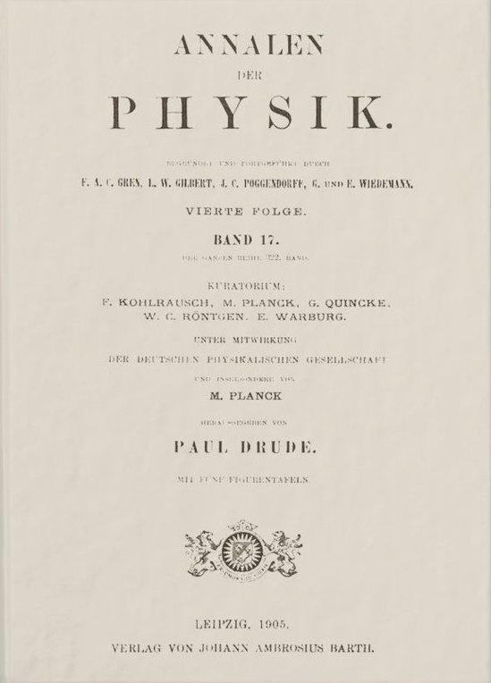
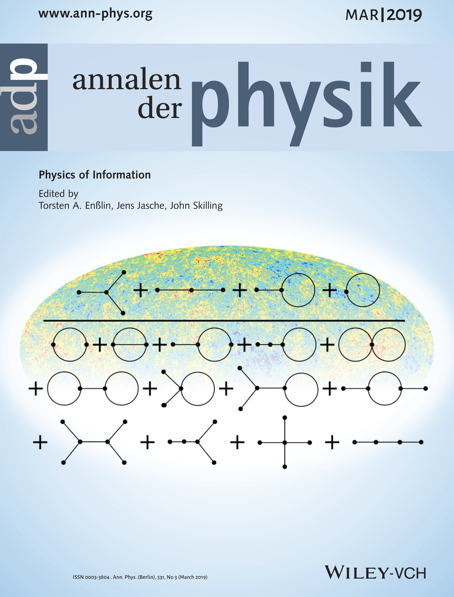
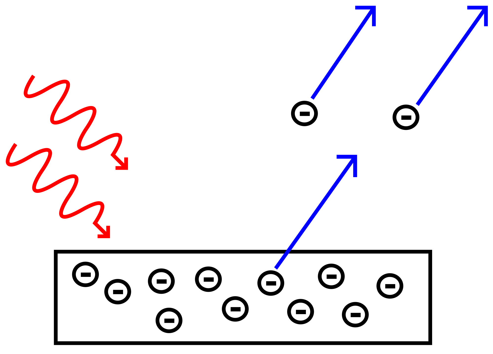
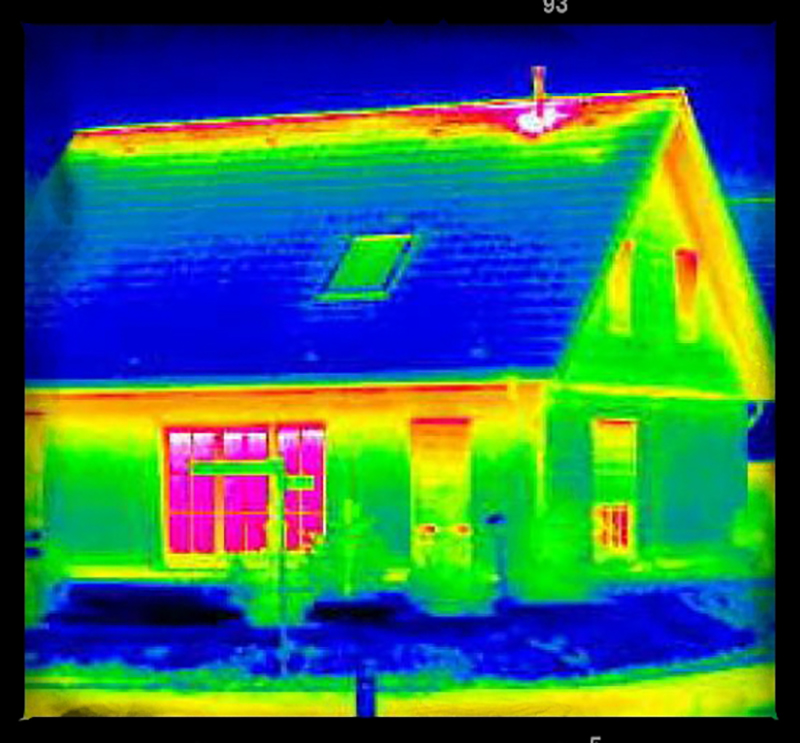
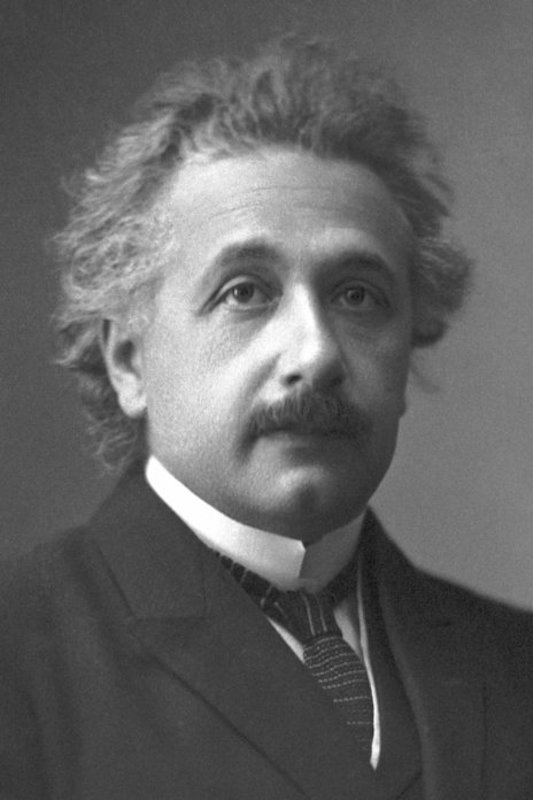

layout: true

<header>
  
Papers We Love, Saint Louis Chapter

  
@CraigBuchek

</header>

<footer>
  
<!-- page numbers -->

  
March 18, 2019

</footer>

---
class: title, middle, center
# The Photoelectric Effect
### by Albert Einstein
#### presented by Craig Buchek

---

### Über einen die Erzeugung und Verwandlung des Lichtes betreffenden heuristischen Gesichtspunkt
### On a Heuristic Viewpoint Concerning the Production and Transformation of Light

* [Original German](https://www.zbp.univie.ac.at/dokumente/einstein1.pdf)
* [English translation](https://en.wikisource.org/?curid=59468)
* [English translation (older)](http://users.physik.fu-berlin.de/~kleinert/files/eins_lq.pdf)

---
class: single-image

# Annus Mirabilis

---

# Annus Mirabilis

1905

* Publications of 4 major papers (June through November)

???

Latin for "extraordinary year"

---

# Annus Mirabilis

* Photoelectric Effect
* Brownian Motion
* Special Relativity
* Mass-Energy Equivalence

???

* Oh, and he also completed his thesis for his PhD on April 30, 1905
    * German: Eine neue Bestimmung der Moleküldimensionen
    * English: On a New Determination of Molecular Dimensions
    * Thesis was accepted July 1905; published in 1907

---

# Publication

_Annalen der Physik_

June 9, 1905

17 pages

???

* Sent March 17, 1905
    * Received March 18, 1905
* Einstein was 26 (as of March 14)
* Was not his first or last paper published there
* Einstein's 5th-most referenced paper
    * The journal's 12-most referenced paper
* Seemed to be his favorite journal to publish in
    * At least between 1901 and 1916
        * Capillary action (1901)
        * General relativity (1916)

---
class: single-image

# Annalen der Physik

---

# Annalen der Physik

* Published since 1799
    * Still [exists](https://onlinelibrary.wiley.com/journal/15213889)
* Lots of well-known physicists published there
    * Max Planck
    * Heinrich Hertz

???

* English translation: Annals of Physics
* Hertz published a paper on the photoelectric effect in 1887
* Was in German until 1950
    * English and German between 1950 and 1990
    * All English as of 1990
* Peer reviewed
    * But not in Einstein's days

---
class: single-image

# Photoelectric Effect

---

# Photoelectric Effect

* When atoms absorb energy from light, electrons are emitted

* Mostly seen in metals
* Discovered by Heinrich Hertz in 1887

???

* Other related effects:
    * photoconductive effect (photoconductivity/photoresistivity)
    * photovoltaic effect
    * photoelectrochemical effect

---

# Photoelectric Effect

* Photosynthesis
* Used to make solar cells
* Photodiodes

---

# Photoelectric Effect

* Causes spacecraft exposed to sunlight to develop a positive charge
* Light from the sun hitting lunar dust causes it to become positively charged

???

* Imbalance can discharge through delicate electrical components

* Charged dust then repels itself and lifts off the surface of the moon by electrostatic levitation
    * Smallest particles might be repelled kilometers from the surface in "fountains"

---

# Photoelectric Effect

* Energy of individual emitted electrons increased with the *frequency* of the light
    * Discovered by Philipp Lenard in 1902
    * At odds with Maxwell's wave theory of light
        * It predicted that electron energy would be proportional to *intensity* of the light

---
class: single-image

# Black Body Radiation

---

# Black Body Radiation

* Idealized physical body that absorbs all incoming electromagnetic radiation
    * Regardless of frequency or angle of incidence
    * Can emit radiation
        * Cannot reflect or transmit electromagnetic radiation

---

# Black Body Radiation

* A black body in thermal equilibrium emits electromagnetic radiation
    * The light emitted is called black-body radiation
    * Radiation is emitted according to Planck's law
    * It has a spectrum that is determined by the temperature alone

---

# Introduction

* Matter is built of atoms and electrons
    * Discrete particles

---

# Introduction

* Light (per Maxwell's theory) is described by wave functions
    * Continuous waves
    * Energy of a light wave emitted from a point source gets increasingly spread out and diffuse over an ever larger volume

---

# Introduction

* Generation and transformation of light seem better modeled by quantized particles
    * Finite number of energy quanta
    * Spatially localized at points of space,
    * Move without dividing
    * Absorbed or generated only as a whole

???

* "The wave theory of light with its continuous spatial functions has proven to be an excellent model of purely optical phenomena,
and presumably will never be replaced by another theory."

* "Despite the perfect agreement of Maxwell's theory with experiment,
the use of continuous spatial functions to describe light may lead to contradictions with experiments,
especially when applied to the generation and transformation of light."

---

# Introduction

* Proposes that "photons" are real
    * Previously proposed by Planck
    * Term "photon" was not coined until 1926

???

He then goes on to propose that light may instead be made up of quanta

---

# Einstein's Thought Experiment

* Imagine a room with perfectly reflecting walls
* In the room is a "black body", some gas molecules, and some free electrons

---
class: single-image

# Nobel Prize

---

# Nobel Prize

1921 Nobel Prize in Physics

For his services to theoretical physics, and especially for his discovery of the law of the photoelectric effect

???

* Announced November 9, 1922
    * Awarded December 10, 1922
* The committee did not issue the award in 1921
    * Awarded it the following year
* Max Planck had received it 3 years earlier
    * "for discovery of energy quanta"
* Niels Bohr received it for 1922
    * "for investigation of the structure of atoms and of the radiation"
* Robert Millikan received it in 1924
    * "for work on the elementary charge of electricity and on the photoelectric effect"
* Einstein was unable to attend the December 10 Nobel Prize Award Ceremony in Stockholm
    * He was "on tour" in Asia, giving lectures
    * He presented his Nobel speech on July 11, 1923, in Gothenburg
* Other prizes:
    * Barnard Medal (1920)
    * Copley Medal (1925)
    * Max Planck Medal (1929)
    * Matteucci Medal (1921)

---
class: single-image

# Einstein

---

# Einstein

* Multiple citizenships
* Friends with many other physicists
* Institute for Advanced Study
* Interest in plumbing
* NAACP

???

* Citizenship:
    * German (renounced to avoid military service)
    * none (1896-1901)
    * Swiss (1901-)
    * Austrian (1911-?)
    * German (1914-1933)
    * USA (1940-)
* Nazis had a $5000 bounty on him
    * They burned his books
    * In London, he had 2 armed guards
    * They raided his cottage, turned it into a Hitler Youth camp
    * Sold his boat
* Got Churchill to bring Jewish scientists to Britain

---

# Einstein

* Multiple citizenships
* Friends with many other physicists
* Institute for Advanced Study
* Interest in plumbing
* NAACP

???

* Friends
    * Bohr
    * Oppenheim
* First 4 members of IAS along with:
    * John von Neumann
    * Kurt Gödel
    * Hermann Weyl
* IAS is now on 1 Einstein Drive
* He considered racism America's "worst disease"
    * Corresponded with civil rights activist W. E. B. Du Bois
        * Du Bois was on trial for not registering the Peace Information Center as a foreign agent
            * Einstein offered to be a character witness for Du Bois
                * The judge decided to drop the case
