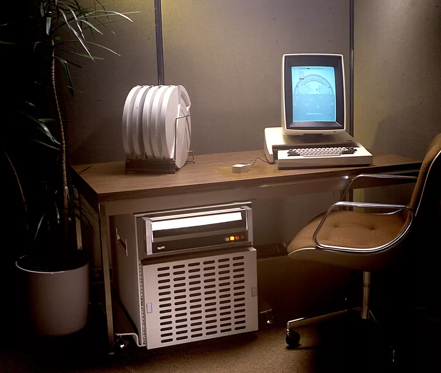

<!-- _class: title lead -->
<!-- _paginate: false # Hide page number on title page. -->

## Craig Buchek

# Fifty Years of Ruby

<!-- 
- Short URL for the slides in lower right
    - Follow along, or look at them later
    - Hit `P` to toggle presenter notes
        - Also links to resources
        - ... and some details that I don't have time to cover
-->

---

> The best way to predict the future is to invent it.

<cite>Alan Kay</cite>

<!--
- Hi, I'm Craig!
- Today, I'm going to talk about:
    - ideas that have led to us being here today
    - people who had a vision of future
    - how they shaped computers we use today
    - how they shaped Ruby
    - what Ruby's future might look like

------

- If you want to "at" me, ...
    - I'm on Twitter and Mastodon via ruby.social
        - ... infrequently
-->

---
<!--
_backgroundColor: black
_class: black
-->

<!--
- February 24, 1993
    - Japanese programmer Yukihiro Matsumoto started developing Ruby
        - "Matz"
- December 21, 1995
    - Released his work (0.95)
- Influenced by:
    - Perl, Smalltalk, Eiffel, Ada, Lisp
    - "more powerful than Perl, and more object-oriented than Python"
- "Ruby is a language designed in the following steps":
    - take a simple lisp language (like one prior to CL).
    - remove macros, s-expression.
    - add simple object system (much simpler than CLOS).
    - add blocks, inspired by higher order functions.
    - add methods found in Smalltalk.
    - add functionality found in Perl (in OO way).
- I will dig into the most similar of those languages:
    - Smalltalk

------

- Image credit: https://upload.wikimedia.org/wikipedia/commons/5/5a/Yukihiro_Matsumoto_EuRuKo_2011.jpg
-->

---
<!--
_class: black
-->

<!--
- My story starts: 1968
    - Matz: 3
    - Me: not even born
    - Most of you: weren't born yet
    - Many of your parents: weren't born yet!
- December 9, 1968
    - ACM conference in San Francisco
- Who: Douglas EngelBART
    - Augmentation Research Center
        - Stanford Research Institute
            - Stanford University
        - ARPA funding
- What: NLS: Online System
- Innovations:
    - Mouse
        - Actually invented at ARC in 1963
    - Personal computing
    - Real-time video conferencing
    - Interactive editing
- Steven Levy dubbed it "the Mother of all Demos"
    - _Insanely Great_, 1994
- TODO: Tell them to watch the video (or fit 1 minute of it in)
- TODO: Better images
- TODO: Explain the picture

------

- TODO: Link to "Augmenting Human Intellect: A Conceptual Framework" (1962)
-->

---

_(cropped).jpg)
# Alan Kay

- TODO: Fix the headers
    - So they're not in middle of screen

<!--
- Attended MoAD
- Degree in Molecular Biology
- Where
    - Stanford AI Lab (1969)
    - Xerox PARC (1970-1981)
    - Atari (1981-1984)
    - Apple (1984-1996)
    - Disney (1997-2002)
- Squeak (1995)

------

- https://tinlizzie.org/IA/index.php/Talks_by_Alan_Kay
- https://www.quora.com/profile/Alan-Kay-11
- Photo credit: https://commons.wikimedia.org/wiki/File:Alan_Kay_(3097597186)_(cropped).jpg
-->

---

<!--
- Founded 1969
- Xerox Palo Alto Research Center (PARC)
    - Silicon Valley
- Lots of people from SRI's Augmentation Research Center
- Innovations:
    - Laser printer
    - GUI, icons
    - Ethernet
    - Real-time video conferencing
    - Interactive editing

------

- Image source: https://www.techspot.com/articles-info/477/images/2015-09-30-image.jpg
-->

---

# Smalltalk-71

~~~ smalltalk-71
to T 'and' :y do 'y'
to F 'and' :y do F

to 'factorial' 0 is 1
to 'factorial' :n do 'n*factorial n-1'

to 'fact' :n do 'to 'fact' n do factorial n. ^ fact n'
~~~

<!--

-->

---

<!--
- 1968: Alan Kay had an idea
    - This cartoon and cardboard mockup
- First paper on it: 1972
    - Named it Dynabook
- Inspired by seeing Logo turtle graphics used in classrooms
    - changed Kay's view of computers and personal computers
        - from just “vehicles” and “tools”
        - to “meta-media” and “for children”
- Portability -> ubiquity
- Says his original innovation was the idea of a personal computer for children
- Key to everything:
    - GUI, windows, icons, mouse, UX
    - OOP

------

- Image credit: https://www.quora.com/What-lessons-were-learned-in-aspiring-towards-the-DynaBook-and-have-any-of-its-original-goals-become-dated/answer/Alan-Kay-11
-->

---

# Smalltalk-72

~~~ smalltalk-72
to square
  (do 4
    (😀 go 50 turn. 90))

to square length
  (👉length 🠔 :.
    do 4 (😀 go length turn 90))!

to poly sides size
  (👉sides 🠔 :. 👉size 🠔 :.
    do sides (😀 go size turn 360/sides))!

to for token step stop var start exp (:👉var.
  (∢←⇒(:start.) 👉start←1).
  (∢to⇒(:stop.) 👉stop←start).
  (∢by⇒(:step.) 👉step←1).
∢do. :#exp. CODE 24)
~~~

<!--
- Some notes:
    - `to` is equivalent to Ruby's `def`
    - 😀 was called smiley
        - 😀 is instance of turtle class
    - Looks a bit Lispy with the nested parens
    - This is 100% accurate UTF transliteration
    - TODO: Understand definition of `for`, `∢`, `do`, and `:#exp`
- Already had `self`

------

- Source: https://smalltalkzoo.thechm.org/papers/EvolutionOfSmalltalk.pdf
-->

---

<!--
- 1973
- "The Interim Dynabook"
- Xerox Alto
    - Introduced March 1, 1973
    - $32k ($200k+ today)
    - 96kB RAM
        - $4k more for 128kB
        - up to 512kB
    - 2.5 MB removable hard drive
    - About 2000 made
        - Mostly used at Xerox and universities
    - Byte magazine in 1981:
        - "It is unlikely that a person outside of the computer-science research community
            - will ever be able to buy an Alto.
            - They are not intended for commercial sale, 
            - but rather as development tools for Xerox, 
            - and so will not be mass-produced.
            - What makes them worthy of mention is the fact that
            - a large number of the personal computers of tomorrow
            - will be designed with knowledge gained from the development of the Alto."
    - Keyboard, mouse (3 buttons), key chorder (5 keys)
    - Size of a small refrigerator
    - Ethernet
- Niklaus Wirth had sabbaticals there in 1976-1977 and 1985
    - Inspired him to build DISER Lilith (1980)
    - Inspired him to create Oberon programming language
- Xerox Star in 1981
    - Sold commercially
    - $16k ($50k+ today)
    - Same year as IBM PC ($2k)

------

- Also inspired SUN workstations
    - Stanford University Network
- https://en.wikipedia.org/wiki/PARC_(company)
- https://en.wikipedia.org/wiki/List_of_people_associated_with_PARC
- PARC campus photo credit: https://preview.redd.it/kjl8la0xow191.jpg?width=900&format=pjpg&auto=webp&s=bc4dfbff6ada4007fdf27ed9fed8dcdbee6ed12e
- Xerox Alto photo credit: https://dq51jve9h21d4.cloudfront.net/sites/default/files/imce/xie-alto-1-886x750.jpg.pagespeed.ic.pU09ByiUIQ.webp
-->

---

# Smalltalk-76

~~~ smalltalk-76
Class new title: 'Point';
 fields: 'x y'. "Cartesian coordinates"

Access to fields
x [⇑x]
y [⇑y]
x: x y: y

Testing
≤pt  "return true if I am below/1eft of pt"
    [⇑x≤pt x and: y≤pt y]

Point arithmetic
+ pt [⇑Point new x: x+pt x y: y+pt y]
- pt [⇑Point new x: x-pt x y: y-pt y]
* scale [⇑Point new x; x*scale y: y*scale]
~~~

- TODO: Move image up

<!--
- All in an IDE in a full GUI windowing system
    - overlapping windows
    - different size fonts, bold, italic
- Source: https://smalltalkzoo.thechm.org/papers/The%20Smalltalk-76%20Programming%20System.PDF
- Dan Ingalls designed Smalltalk-76
    - more of a compromise between the Lisp and Algol worlds
        - brilliant design; not much flexibility was lost
    - almost 200 times faster than Smalltalk-72
-->

---

# Smalltalk-80

TODO

<!--
- Smalltalk-80: first public release
- Added blocks, booleans, meta-classes
-->

---

<!--
- First Smalltalk book, 1983
- Adele Goldberg
    - Xerox PARC
    - One of the designers/implementers of Smalltalk
- Several in a series
-->

---

# OOP
TODO: picture of cells

<!--
- Alan Kay coined the term "object-oriented programming" in 1967
- "objects" that encapsulate data and behavior
    - interacting with each other through messages
- He'd been working on the ideas since 1966
- He regrets the term
    - Should have been "message-oriented programming"
    - "I'm sorry that I long ago coined the term "objects" for this topic because it gets many people to focus on the lesser idea. The big idea is "messaging"."
        - https://lists.squeakfoundation.org/pipermail/squeak-dev/1998-October/017019.html
    - "OOP to me means only messaging, local retention and protection and hiding of state-process, and extreme late-binding of all things."
- Regrets that Smalltalk did not evolve after Smalltalk-80
- Smalltalk was 1st OOP language
    - or so I thought ...
-->

---

# Simula 67

~~~ simula-67
Class Rectangle (Width, Height); Real Width, Height;
                         ! Class with two parameters;
   Begin
      Real Area, Perimeter;  ! Attributes;

      Procedure Update;     ! Methods (Can be Virtual);
      Begin
         Area := Width * Height;
         Perimeter := 2*(Width + Height)
      End of Update;

      Boolean Procedure IsSquare;
         IsSquare := Width=Height;
      Update;               ! Life of rectangle started at creation;
    OutText("Rectangle created: "); OutFix(Width,2,6);
    OutFix(Height,2,6); OutImage
End of Rectangle;
~~~

<!--
- Or perhaps Simula 67 was the first OO language
    - Derived from ALGOL 60
        - Most languages we use today are ancestors of ALGOL 60
- "more" syntax than we see today
- but you can make everything out
    - types
    - instance variables
    - class keyword for user-defined types
    - methods
    - ...
- code source: https://staff.um.edu.mt/jskl1/talk.html
-->

---

# Simula 67

~~~ simula-67
Rectangle Class LocRectangle (X, Y); Integer X, Y;
Begin                                        ! More parameters;
   Boolean Tall;                             ! More attributes;
   Procedure Move (Dx, Dy); Integer Dx, Dy;  ! More methods;
   Begin
      X := X + Dx; Y := Y + Dy
   End of Move;
   Tall := Height > Width;
   OutText("Located at: "); OutFix(X,2,6); OutFix(Y,2,6); OutImage
End of LocRectangle;
~~~

<!--
- but you can make everything out
    - ... subclass inheriting from superclass
        - and adding more instance variables
- Simula 67
    - garbage collection
    - objects were processes
        - actor model
        - coroutines
            - no true parallelism
- code source: https://staff.um.edu.mt/jskl1/talk.html
-->

---

<!--
- 1984: Macintosh
- Steve Jobs and Apple folks visited PARC in 1979 (twice)
    - Xerox received some Apple stock options
    - Inspired the Mac
    - Smalltalk-76, networking, mouse-driven WYSIWYG GUI
    - "Xerox could have owned the entire computer industry, could have been the IBM of the nineties, could have been the Microsoft of the nineties." -- Steve Jobs
- Alan Kay joined apple in 1984
    - Had been at Atari for a few years
    - Stayed until 1996
- Kay's criticism of iPad
    - Not user programmable
    - Not designed for authoring meta-media
    - Not designed for kids
    - No physical keyboard
    - "The Mac was a failure in the sense that it didn't achieve the goal of changing the way people think about computers."
    - "The Mac was a success in the sense that it was a very good implementation of the ideas that were around at the time."
- Kay says Microsoft Surface tablet is closer to his vision
- OLPC: One laptop per child (2005)
    - encourages children to interact with & change code on their computer
-->

---

# 1996: Squeak

- Modern Smalltalk

---

<!--
- October 3, 1996
- IMHO, one of the best "Ruby" books
- Design patterns "in the small"
- Kent Beck
    - Agile Manifesto
    - Extreme Programming
    - Wrote _the_ book on Test-Driven Development
    - JUnit
-->

---

<!--
- December 15, 2000
- "Pickaxe book"
- First English-language book on Ruby
- TODO: Picture of Dave Thomas
- Dave Thomas (Pragmatic Dave)
    - Pragmatic Programmer book
        - Coined "DRY"
    - Pragmatic Bookshelf
    - Agile manifesto (2001)
    - Brought Agile/XP practices to Ruby
- TODO: New version
-->

---

<!--
- 2004: Ruby on Rails
- David Heinemeier Hansson
    - Danish programmer
    - Using Ruby since 2003
    - Was doing PHP before that
- Released Rails publicly on July 25 2004
    - part of framework he built for Basecamp at 37 Signals
    - marketed Rails w/ 5-minute blog video
        - Fast at editing: TextMate
    - Convention over Configuration
    - Big reduction in code vs Java frameworks
    - 0.1 release was 2003
    - 0.8 release October 25, 2004
    - 1.0 release December 13, 2005
    - Announcement: https://web.archive.org/web/20040823214652/http://blade.nagaokaut.ac.jp/cgi-bin/scat.rb/ruby/ruby-talk/107370
- Made enough money to buy himself a bespoke exotic race car
    - His Wikipedia entry has much more detail on his racing career than Rails
- image credit: https://dhh.dk/images/headshot-2017-full.jpg
- image credit: https://commons.wikimedia.org/wiki/File:Ruby_on_Rails-logo.png
-->

---

<!--
- Dave Thomas (Pragmatic Dave)
    - with DHH
- August 7, 2005
- TODO: More about this book
- TODO: New version
-->

---

- TODO: Crop off the bottom of the image, so we can see the top of the picture

<!--
- 2007: Avi Bryant at RailsConf
- "Smalltalk’s Lessons for Ruby"
- Ruby IS-A Smalltalk
- Lessons the Ruby community should learn from Smalltalk
    - TODO: What are the lessons?
- TODO: Story about this talk
- TODO: Read the links below
- Source: http://lambda-the-ultimate.org/node/2573
- Source: https://www.artima.com/forums//threaded.jsp?forum=155&thread=220183
- Source: https://news.ycombinator.com/item?id=3029981
- Source: https://web.archive.org/web/20170421065632/http://blog.redtexture.net/2010/10/30/avi-bryants-presentations/#Avi%20Bryant's%20Presentations
- Source: https://www.akitaonrails.com/2007/12/21/chatting-with-avi-bryant-part-1
- Source: https://www.akitaonrails.com/2007/12/22/chatting-with-avi-bryant-part-2
- Source: http://web.archive.org/web/20130729204305id_/http://itc.conversationsnetwork.org/shows/detail3432.html
- Image source: https://www.flickr.com/photos/x180/505428676
-->

---

# Ruby was a **rediscovery** of Smalltalk

<!--
- [read slide]
-->

---

# Newer Ruby Features

- Refinements
- Data classes
- Pattern matching
- Concurrency
- Immutable objects

<!--
- Most of us are not using Ruby to its full potential
    - Not using modern Ruby features
        - I have not used most of these
- QUESTION: Who uses refinements regularly?
- QUESTION: Who is using pattern matching?
- QUESTION: Who is using Data class?
- QUESTION: Who is using concurrency in Ruby?
-->

---

TODO: 2008: Pharo

<!--
- Today: OpenSmalltalk Virtual Machine, shared among Squeak, Pharo, Cuis, Newspeak
- Cuis looks interesting
-->

---

# 2012: Elixir

- FP
- Ruby-like syntax
    - DSLs
- Erlang VM
- Concurrency
    - Lightweight threads
- Fault tolerance
- Scalability
- Meta-programming

<!--
- Lightweight threads
    - 1 million threads on a 16-core machine
- Elixir scales
    - Small embedded devices
    - Large clusters & distributed systems
- Fault tolerance
- https://elixir-lang.org/
-->

---

# 2014: Crystal

- Effectively compiled Ruby
- Lose some meta-programming
- Typed, but minimal type hints
- Nil checking
    - No nil errors at runtime!
        - Eliminates a whole class of bugs
- Fast
- Decent community/libraries

~~~ crystal
x = [] of Int32;

# TODO: show nil checking
# TODO: show meta-programming differences
~~~

<!--
- I gave talk on Crystal very early on
    - local Ruby user group - STLRuby
    - had one of the 2 originators on video
- https://crystal-lang.org/
-->

---

# 2015: Rust

- Fast and memory-efficient
- Low-level
- Embedded
- Borrow checker
    - Ownership of mutable values
    - Eliminates a whole class of bugs

<!--
- https://www.rust-lang.org/
-->

---

# Ruby's Future

- Ruby will still get new features
    - Innovations
    - Borrowing/stealing
- Ruby will last a long time
- Something will replace Ruby

<!--

- Good solutions are rediscovered
    - We need to look out for other solutions we can learn from
- Compiled languages are winning again
- Many Rubyists have already moved to other languages
    - And communities
        - Community is important
            - Why I keep attending conferences
    - They take what they've learned with them
        - Features
        - Practices
        - Community
        - DX
- Ruby is still alive and doing well
    - Bright future for many years to come
    - It will adapt
- Eventually Ruby use will dwindle
    - Long tail
-->

---

# Take-aways

- Good solutions are rediscovered
- Ruby will last a long time
- Ruby will still get new features
- Something will replace Ruby
- TBD

<!--

- Good solutions are rediscovered
    - We need to look out for other solutions we can learn from
- Compiled languages are winning again
- Many Rubyists have already moved to other languages
    - And communities
        - Community is important
            - Why I keep attending conferences
- Ruby is still alive and doing well
    - Bright future for many years to come
    - It will adapt
- Eventually Ruby use will dwindle
    - Long tail
-->

---

> A change in perspective is worth 80 IQ points.

<cite>Alan Kay</cite>

<!--
- Go learn other languages!
    - It'll make you a better Ruby programmer
-->

---

> Technology is anything invented after you were born.

<cite>Alan Kay</cite>

<!--
- [read quote]
- TODO: Douglas Adams follow-on quote?
- TODO: There was some point I wanted to make here
-->

---

> The best way to predict the future is to invent it.

<cite>Alan Kay</cite>

<!--
- Let's help invent the future!
    - Explore whether decisions made are still valid
    - Experiment with language features
        - Add to Ruby
        - Look at ideas from presentations by TODO: list people
        - Steal from other languages
    - Find ways to help the Ruby maintainers
    - Get involved in community for new upcoming language
        - Shape their libraries
        - Shape their tools
- Have fun!
-->

---

# Thank You

* Attendees
* Viewers
* RubyConf organizers
* People that helped me with the talk
    - **Noel Rappin**

---

# Come talk to me!

Ask me about:

- This talk (or others)
- Yoga
- Agile
- Job interviews

Tell me about:

- This talk (or others)
- Principal Engineer jobs
    - https://resume.CraigBuchek.com
- Hexagonal Architecture
- Cool language features

---

# Colophon

- [Marp](https://marp.app/) (https://marp.app/)
- [mise](https://mise.jdx.dev/) (https://mise.jdx.dev/)
- Source: https://github.com/booch/presentations/

---

# Contact Info

- GitHub: [booch](https://github.com/booch), [boochtek](https://github.com/boochtek)
- Email: first.last@Gmail.com
- LinkedIn https://linkedin.com/in/craigbuchek
- Web page: https://CraigBuchek.com
- Everywhere else: CraigBuchek
