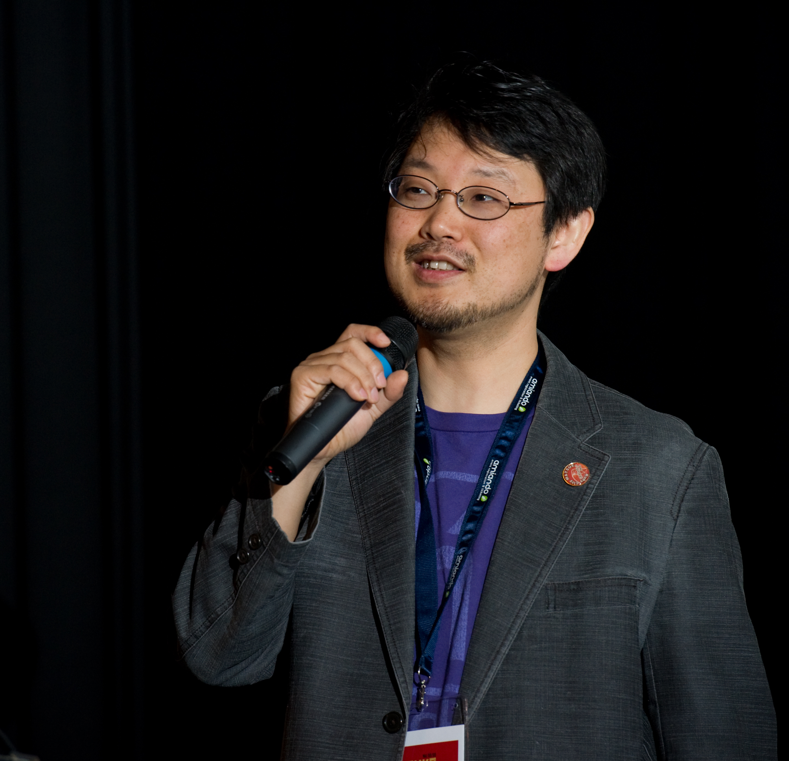

<!--
_class: title lead
-->

# Fifty Years of Ruby

## Craig Buchek

### RubyConf 2024

<!-- 
- Follow along, or look at slides later
    - Short URL in upper left
    - Hit `P` to toggle presenter notes
        - Also links to resources
        - ... and some details that I don't have time to cover
-->

---

> The best way to predict the future is to invent it.

<cite>Alan Kay</cite>

<!--
- Hi, I'm Craig!
- Today, I'm going to talk about:
    - ideas that led to us being here today
    - how we got here
        - people who had a vision of future
        - how they shaped computers we use today
        - how they shaped Ruby
    - what Ruby's future might look like

- If you want to "at" me, ...
    - I'm on Twitter and Mastodon via ruby.social
        - ... infrequently
-->

---
<!-- _class: dark -->

<!--
- We're all here today because...
- YukiHIRO MatsuMOTO
    - AKA "Matz"
    - inspired to write programming language
- Goal: programmer happiness, joy, productivity
- Influenced by:
    - Perl, Smalltalk, Eiffel, Ada, Lisp
- I will focus mostly on Smalltalk
    - how it influenced Ruby

- Image credit: https://upload.wikimedia.org/wikipedia/commons/5/5a/Yukihiro_Matsumoto_EuRuKo_2011.jpg
-->

---
<!-- _class: dark -->
#### 1968

<!--
- My story starts: 1968 (December 9)
- Mother of All Demos
- Joint Computer Conference in San Francisco
- About 2000 attendees
- Douglas EngelBART
    - Stanford Research Institute (SRI)
        - Augmented Human Intellect Research Center (ARC)
            - Started in 1962
    - Showed NLS (oN-Line System)
- Vision of personal computing
    - Interactive!
    - Computing at that time:
        - Mainframes
        - Batch processing
        - Maybe time-sharing
- Innovations introduced:
    - Mouse
        - Invented in 1963 at SRI
    - Key chorder (on left)
        - Press multiple keys at once
        - Commands
    - Networking
        - Mentioned ARPANET coming soon
    - Video conferencing
    - Full-screen interactive editor
        - Copy & paste
        - Collaborative editing
            - Shared screen
                - Multiple cursors
    - Hyperlinks
- Watch the video!
    - 5 minutes: https://www.youtube.com/watch?v=B6rKUf9DWRI
    - 3 parts: https://www.youtube.com/watch?v=UhpTiWyVa6k

- Steven Levy dubbed it "the Mother of all Demos"
    - _Insanely Great_, 1994
- "Augmenting Human Intellect: A Conceptual Framework" (Engelbart, SRI, 1962)
    - https://www.dougengelbart.org/pubs/augment-3906.html
- Source: https://en.wikipedia.org/wiki/The_Mother_of_All_Demos
- Photo credit: https://qph.cf2.quoracdn.net/main-qimg-401017ddb89209598d6f0f9b74f5a1d8
- Book: What the Dormouse Said by John Markoff (2005)
- TODO: Link to more articles
- Joint Computer Conference
    - American Federation of Information Processing Societies (AFIPS)
    - Association for Computing Machinery (ACM)
    - Institute of Electrical and Electronics Engineers (IEEE)
    - Held annually 1951-1987
-->

---
<!-- _class: dark -->

<!--
- Attendee at MoAD:
    - Alan Kay
- Bachelor degree in Math & Molecular Biology
- Graduate school at University of Utah
    - Sketchpad (first computer graphics, GUI)
        - "Master" drawing (objects) & instance drawings
    - Simula-67
        - Objects

- https://tinlizzie.org/IA/index.php/Talks_by_Alan_Kay
- https://www.quora.com/profile/Alan-Kay-11
- Photo credit: https://commons.wikimedia.org/wiki/File:Alan_Kay_(3097597186)_(cropped).jpg
- Alan's career:
    - Stanford AI Lab (1969)
    - Xerox PARC (1970-1981)
    - Atari (1981-1984)
    - Apple (1984-1996)
    - Disney (1997-2002)
-->

---
#### 1968

<!--
- 1968 (shortly before MoAD)
- Alan Kay drew this cartoon
    - Later named it Dynabook
- Original innovation: idea of personal computer for children
- Inspired by Logo turtle graphics

- Image credit: https://www.quora.com/What-lessons-were-learned-in-aspiring-towards-the-DynaBook-and-have-any-of-its-original-goals-become-dated/answer/Alan-Kay-11
-->

---
<!-- _class: dark -->
#### 1969

<!--
- 1969: Xerox opened Palo Alto Research Center
    - PARC
    - Palo Alto in Silicon Valley
- Alan Kay joined, 1970
- Lots of people from SRI's Augmentation Research Center
    - People from Engelbart's lab
- Invented:
    - Laser printer
    - Ethernet
    - among others

- Image source: https://www.techspot.com/articles-info/477/images/2015-09-30-image.jpg
-->

---
#### 1972
# Smalltalk-72

~~~ smalltalk-72
to box b | x y size tilt "x, y, size, tilt are instance variables"
  (ISNEW   »    (SELF undraw. 'size 🠔 size + :. SELF draw. ⇑SELF)
  ⏿draw    »    (😀 place x y turn tilt. square size.)
  ⏿undraw  »    (😀 white. SELF draw. 😀 black)
  ⏿turn    »    (SELF undraw. 'tilt 🠔 tilt + :. SELF draw)
  ⏿size    »    (⇑size))

to square size
  (poly 4 size)

to poly sides size
  (👉sides 🠔 :. 👉size 🠔 :.
    do sides (😀 go size turn 360/sides))

👉mybox 🠔 box 0 0 50 0
mybox turn 45  "redraw box turned 45°"
~~~

<!--
- 1972
- Hallway discussion at PARC:
    - How small could a message-based language be?
    - Alan Kay: No more than a page of code
    - Dan Ingalls: Prove it!
    - Inspired by Lisp and Simula,
        - Alan Kay wrote basic Smalltalk in 2 weeks
    - Dan Ingalls ran with it
        - later joined by Adele Goldberg
        - 80 releases over next 8 years
- Main ideas:
    - Everything is an object
    - Objects communicate by sending & receiving messages
    - Objects have own memory
    - Every object is an instance of a class
    - Class holds shared behavior for its instances
- Primitive
    - No clear distinction between classes and instances
- This is 100% accurate UTF transliteration
    - Emoji were in black & white
- Notes on code:
    - `to` is equivalent to Ruby's `def`
        - from Logo
    - 😀 was called smiley
        - instance of turtle class
    - Looks a bit Lispy with the nested parens

- Primary source: http://gagne.homedns.org/~tgagne/earlyhistoryst.html
- Primary source: https://smalltalkzoo.thechm.org/papers/EvolutionOfSmalltalk.pdf
- Primary source: https://smalltalkzoo.thechm.org/papers/Smalltalk72_Manual.pdf
- Source: https://smalltalkzoo.thechm.org/papers/EvolutionOfSmalltalk.pdf
-->

---
<!-- _class: dark -->
#### 1973

<!--
- 1973 (March 1)
- Xerox Alto
    - "The Interim Dynabook"
    - Size of a small refrigerator
    - $32k ($200k+ today)
        - Not intended for commercial sale
            - Internal use for research
            - Universities
    - 96kB RAM
    - 2.5 MB removable hard drive
    - Monitor
        - ~500,000 bitmapped b/w pixels
        - "portrait" orientation
            - like we normally use paper
    - Mouse (3 buttons), key chorder (5 keys), keyboard
    - GUI
        - Overlapping windows, icons, menus, pointer
    - First WYSIWYG editor: Bravo
        - Charles Simonyi
            - Later: Microsoft Word

- 1981: Xerox Star
    - Sold commercially
    - $16k ($50k+ today)
    - Same year as IBM PC ($2k)
    - Part of a $75k system
        - "Office of the future"
        - Server
        - Laser printer
- Also inspired SUN workstations
    - Stanford University Network
- https://en.wikipedia.org/wiki/PARC_(company)
- https://en.wikipedia.org/wiki/List_of_people_associated_with_PARC
- PARC campus photo credit: https://preview.redd.it/kjl8la0xow191.jpg?width=900&format=pjpg&auto=webp&s=bc4dfbff6ada4007fdf27ed9fed8dcdbee6ed12e
- Xerox Alto photo credit: https://crm.org/articles/xerox-parc-and-the-origins-of-gui
-->

---
#### 1976
# Smalltalk-76

~~~ smalltalk-76
Class new title: 'Point';
    fields: 'x y'. "Cartesian coordinates"

"Access to fields"
x [⇑x]
y [⇑y]
x: x y: y

"Testing"
≤pt  "return true if I am below/1eft of pt"
    [⇑x≤pt x and: y≤pt y]

"Point arithmetic"
+ pt [⇑Point new x: x+pt x y: y+pt y]
- pt [⇑Point new x: x-pt x y: y-pt y]
* scale [⇑Point new x; x*scale y: y*scale]
~~~

<!--
- Dan Ingalls designed Smalltalk-76
    - Almost 200 times faster than Smalltalk-72
    - Blocks
    - Keyword arguments
    - Starting to look modern
-->

---
#### 1980
# Smalltalk-80

~~~ smalltalk
x := OrderedCollection with: 1 with: 2 with: 3.
x addFirst: 0.
x select: [:n | n > 1].  "result: #(2 3)"
x collect: [:n | n * n]. "result: #(0 1 4 9)"
x inject: 0 into: [:a :n | a + n]. "result: 6"

Object subclass: #MessagePublisher
    instanceVariableNames: ''
    classVariableNames: ''
    category: 'Smalltalk Examples'
publish
    Transcript show: 'Hello, World!'
multiply: i1 and: i2 by: n
    | mul |
    mul := i1 * i2.
    ^mul * n  "Return i1 * i2 * n"
~~~

<!--
- Smalltalk-80: first public release
- Ruby has `collect` as an alias for `map`
    - And `inject` as an alias for `reduce`
-->

---
<!-- _class: dark -->
#### 1981

Byte-1981-08-Smalltalk.jpg

<!--
- August 1981
- Byte magazine
- Special issue
    - Included 13 articles on Smalltalk and OOP
    - "a large number of the personal computers of tomorrow" ...
    - "will be designed with knowledge gained from the development of the Alto."
    - but you probably won't be able to buy one

- Previous August issues of Byte covered:
    - 1977: APL
    - 1978: Pascal
    - 1979: Lisp
    - 1980: Forth
- Later August issues covered:
    - 1982: Logo
    - 1983: C
    - 1984: Modula-2
    - 1985: Declarative languages
        - Also intro of Commodore Amiga
    - 1986: Object-Oriented Languages
    - 1987: Prolog
- Source: https://archive.org/details/byte-magazine-1981-08
-->

---
<!-- _class: dark -->
#### 1983

<!--
- First Smalltalk book, 1983
- Adele Goldberg

- Several in a series
    - Blue
    - Green
    - Red
-->

---
#### 1984

<!--
- Steve Jobs and Apple folks visited PARC in 1979 (twice)
    - Xerox received some Apple stock options
    - Smalltalk-76, networking, mouse-driven WYSIWYG GUI
        - Jobs was enamored by the GUI
    - Inspired the Lisa and Mac
    - Jobs later said:
        - "Xerox could have owned the entire computer industry,"
        - "could have been the IBM of the nineties,"
        - "could have been the Microsoft of the nineties."
- 1984: Alan Kay joined Apple

- Kay on Mac:
    - "The Mac was a failure in the sense that it didn't achieve the goal of changing the way people think about computers."
        - Me: LOLWAT!!!?????
    - "The Mac was a success in the sense that it was a very good implementation of the ideas that were around at the time."
-->

---
#### 1991
# Perl 4

~~~ perl-4
@numbers = (1, 2, 3, 4, 5);
$total = 0;
foreach $num (@numbers) {
    $total += $num;
}
print "Sum: $total\n";

$filename = "sample.txt";
open(FILE, $filename) || die "Cannot open $filename\n";
while ($line = <FILE>) {
    print $line;
}
close(FILE);

%ages = ("Alice" => 30, "Bob" => 25);
print "Alice is $ages{'Alice'} years old.\n";
~~~

<!--
- 1991
- Perl 4
    - Larry Wall
    - More powerful scripting language than:
        - UNIX shell, sed, awk
- Perl was started in 1987
    - Not popular until Perl 4
- Designed so computer programmers could write programs more quickly and easily
    - "Easy things should be easy and hard things should be possible"
- No objects until Perl 5 in 1994
-->

---
<!-- _class: dark -->
#### 1991

<!--
- 1991 (to coincide with Perl 4)
- Programming Perl "camel book" released
    - Larry Wall & Randal Schwartz

- Image source: https://en.wikipedia.org/wiki/Programming_Perl
-->

---
#### 1993
# Ruby as an Idea

~~~
keiju> By the way, do you have considered the name of the language?  
matz> Well, Tish, if it's like shell enough.
matz> But I want a smarter name.
keiju> Toilet paper?  
...
keiju> ruby 
keiju> a jewelry name after all 
matz> why jewel's name?
keiju> perl 
matz> I see
keiju> But, perl is related to a shell.  
...
matz> What is your best up to now?
keiju> I'm content with coral.
matz> I thought ruby is cool as a codename, isn't it
keiju> Well. Ruby is also good.
~~~

<!--
- Matz considered:
    - Perl: "toy" language
    - Python: not OO enough
- Matz wanted:
    - Simple syntax
    - Truly OO
    - Iterators & Closures
    - Exception Handling
    - Garbage Collection
- Didn't exist, so he created it
- 1993 February 24
    - Matz and his friend picked the name "Ruby"

- Source (translated): https://blade.ruby-lang.org/ruby-talk/88819
-->

---
<!-- _class: dark -->
#### 1995
# Ruby 0.95

<!--
- 1995 December 21
- Matz announces Ruby 0.95
    - Japanese newsgroups

- Image credit: https://www.goodfon.com/holidays/wallpaper-download-3584x2240-happy-birthday-decoration-krem-celebration-colorful-keks-cup.html
-->

---
#### 1996

<!--
- 1996
- Squeak
    - Modern portable Smalltalk
    - Written in Smalltalk
    - Compiles to C
- Apple
    - Alan Kay
    - Dan Ingalls
- Moved to Disney in 1997
- Scratch visual programming language
    - built on Squeak

- Primary source: https://dl.acm.org/doi/pdf/10.1145/263698.263754
- Source: https://en.wikipedia.org/wiki/Squeak
- Image source: https://squeak.org/
-->

---
<!-- _class: dark -->
#### 1996

<!--
- 1996 (October 3)
- IMHO, one of the best "Ruby" books
    - Design patterns "in the small"
- Kent Beck
    - Wrote _the_ book on Test-Driven Development
    - Wrote _the_ book on Extreme Programming
    - Agile Manifesto, Extreme Programming
-->

---
<!-- _class: dark -->
#### 1996
# Ruby 1.0

<!--
- 1996: Ruby 1.0
- First of many major releases on Christmas
- Creates ruby-list mailing list
    - Japanese

- Image credit: https://www.goodfon.com/new-year/wallpaper-download-1920x1200-novyy-god-shary-krasnyy-elka.html
-->

---
#### 1998
# Ruby 1.2

- First stable release
- `true` and `false` keywords
- `&&=` and `||=`
- `defined?`

<!--
- 1998: Ruby 1.2
- First stable release
- `true` and `false` keywords
- `||=`

- Primary source: https://github.com/github/ruby-thecodeshop/blob/v1_2_stable/ChangeLog
- Image credit: https://www.online-therapy.com/blog/borderline-personality-disorder-vs-stability-life/
-->

---
<!-- _class: dark -->
#### 1999

<!--
- 1999 October
    - First Ruby book published
- Written by Matz & Keiju Ishitsuka (KAY-jew I-shee-TSU-ka)
    - Japanese 
    - The Object-Oriented Scripting Language Ruby

- Source: https://auth0.com/blog/a-brief-history-of-ruby/
- Source: https://www.amazon.co.jp/%E3%82%AA%E3%83%96%E3%82%B8%E3%82%A7%E3%82%AF%E3%83%88%E6%8C%87%E5%90%91%E3%82%B9%E3%82%AF%E3%83%AA%E3%83%97%E3%83%88%E8%A8%80%E8%AA%9E-ASCII-SOFTWARE-SCIENCE-Language/dp/4756132545
-->

---
<!-- _class: dark -->
#### 2000

<!--
- 2000
    - 20 more Ruby books
        - in Japanese
    - Ruby more popular in Japan than Perl or Python
- 2000 December 15: "Pickaxe book"
- First English-language book on Ruby
- Covered Ruby 1.6
- Dave Thomas & Andy Hunt
    - Pragmatic Programmer book
- Dave Thomas: Agile manifesto (2001)
    - Brought Agile practices to Ruby
- Latest (5th) edition: Ruby 3.3
    - Noel Rappin

- NOTE: Some sources say 2001 December 15
    - but Amazon has reviews from early 2001
-->

---
<!-- _class: dark -->
#### 2001

<!--
- 2001 April 12-13
- First International Ruby Conference
    - Tampa, FL
    - organizers
        - David Alan Black
        - Chad Fowler
        - Dave Thomas
    - later founded nonprofit Ruby Central
        - to run future conferences
            - including this one!

- Image source: https://www.flickr.com/photos/elabsse/9023807719
- Image source: https://www.linkedin.com/in/dablack/
-->

---
#### 2001
# JRuby

- Runs on JVM
    - Faster
    - Java interoperability
    - Java libraries
- Jan Arne Petersen
- Charles Nutter
- Thomas Enebo

<!--
- 2001: JRuby
- Jan Arne Petersen
- JVM
    - Faster
    - interoperates w/ Java and its libraries
    - if you're approved to use Java ...
- later Charles Nutter, Thomas Enebo
-->

---
#### 2003
# Ruby 1.8

- String interpolation of expressions
- Enumerable `all?`, `any?`
- Enumerable `inject`
    - AKA `reduce`
- Net::HTTP breaking changes
- Libraries (lots!)
- Hooks

<!--
- 2003 (August 4)
- Ruby 1.8
- First "mature" Ruby, IMO
- Lots of libraries added
    - YAML
    - CSV
    - WEBrick
    - open-uri
    - OpenSSL
    - Test::Unit
- String interpolation of any expression
    - Previously just variables
- Enumerable `inject`
    - Borrowed from Smalltalk
    - Later aliased as `reduce`
-->

---
<!-- _class: dark -->
#### 2004

<!--
- 2003:
    - David Heinemeier Hansson (DHH)
    - Built Basecamp at 37 Signals
        - Using Ruby
    - Had been coding in PHP
- MVC web framework
    - Extracted from Basecamp
- 2004 July 25: Ruby on Rails 1st public release
- Marketed w/ 15-minute video
    - Builds a blog app
    - Fast at editing: TextMate
- Ruby's killer app
- Big reduction in code vs Java web frameworks
    - DSLs (meta-programming)
    - Convention over configuration
- Huge growth of community

- Rails announcement: https://web.archive.org/web/20040823214652/http://blade.nagaokaut.ac.jp/cgi-bin/scat.rb/ruby/ruby-talk/107370
- Original Rails blog video: https://www.youtube.com/watch?v=Gzj723LkRJY
- 0.8 release October 25, 2004
- 1.0 release December 13, 2005
- Made enough money to buy himself a bespoke exotic car
    - https://world.hey.com/dhh/my-all-time-dream-car-1b28942d
    - His Wikipedia entry has much more detail on his racing career than Rails
- image credit: https://dhh.dk/images/headshot-2017-full.jpg
- image credit: https://commons.wikimedia.org/wiki/File:Ruby_on_Rails-logo.png
-->

---
#### 2004
# Groovy

- JVM
- Concise syntax
- Dynamic typing
- Meta-programming
- DSLs
- Grails (2006)

~~~ groovy
languages = ["Ruby", "Java"]
languages << "Groovy"
languages.each { println "Language: $it"}

def say(msg = 'Hello', name = 'world') {
    "$msg $name!"
}
say
say()
say 'Hello'

class Test implements GroovyInterceptable {
    def sum(Integer x, Integer y) { x + y }
    def invokeMethod(String name, args) {
        System.out.println "Invoke method $name with args: $args"
    }
}
def test = new Test()
test?.sum(2,3)
test?.multiply(2,3)

class Foo {
   def propertyMissing(String name) { name }
}
def f = new Foo()
assert f.boo == "boo"
~~~

<!--
- Also 2004: Groovy
- JVM
- Superset of Java!
- From Ruby:
    - concise syntax
    - dynamic typing
    - closures
    - meta-programming

- Primary source: https://web.archive.org/web/20030901064404/http://radio.weblogs.com/0112098/2003/08/29.html
- Primary source: https://groovy-lang.org/
-->

---
<!-- _class: dark -->
#### 2005

<!--
- 2005 August
- First Rails book
- Dave Thomas
    - with DHH
- I learned Ruby and Rails from this
    - late 2005
- Note the title: *Agile*
    - Dave Thomas brought Agile from start
- Rails 8 edition: coming 2025
-->

---
<!-- _class: dark -->
#### 2007

<!--
- 2007: Avi Bryant at RailsConf
- "Smalltalk’s Lessons for Ruby"
- Avi Bryant
    - Seaside web framework
    - GemStone Smalltalk
    - MagLev
        - Ruby VM based on GemStone
- Lessons the Ruby community should learn from Smalltalk
    - Premise: Ruby and Smalltalk are **dialects** of same language
    - Ruby could/should be faster
        - As fast as Smalltalk
        - As fast as Java
            - Java's VM tech came from a Smalltalk research project
- My take-away: Ruby was a **rediscovery** of Smalltalk
    - Smalltalk community **became** Ruby community

- Source: http://lambda-the-ultimate.org/node/2573
- Source: https://www.artima.com/forums//threaded.jsp?forum=155&thread=220183
- Source: https://news.ycombinator.com/item?id=3029981
- Source: https://web.archive.org/web/20170421065632/http://blog.redtexture.net/2010/10/30/avi-bryants-presentations/#Avi%20Bryant's%20Presentations
- Source: https://www.akitaonrails.com/2007/12/21/chatting-with-avi-bryant-part-1
- Source: https://www.akitaonrails.com/2007/12/22/chatting-with-avi-bryant-part-2
- Source: http://web.archive.org/web/20130729204305id_/http://itc.conversationsnetwork.org/shows/detail3432.html
- Image source: https://www.flickr.com/photos/x180/505428676
-->

---
#### 2007
# Ruby 1.9

- YARV interpreter
- "Stabby" lambda
- Hash colons
- RubyGems
- Variables scoped to blocks
- Compatibility issues!

~~~ ruby
f = ->(a,b) { puts a + b }

has_rockets = { :a => 1, :b => 2 }
has_colons = { a: 1, b: 2 }
has_colons == has_rockets

def foo
  1.times { x = 2 }
  puts x # Worked in 1.8; NameError in 1.9
end
~~~

<!--
- 2007
    - Ruby 1.9
    - 3 years after 1.8
        - Longest between major releases
- YARV
    - Yet Another Ruby VM
    - Faster
- MRI
    - Matz's Ruby Interpreter
- "Stabby" lambda
- Hash colons
    - Company named Hash Rocket
- Compatibility nightmare
    - Gems didn't work with each other
    - 1.9.1 had a different ABI than 1.9.0
    - Provoked Bundler (2009)
- 2011: Ruby 1.9.3
    - Stability, finally!
-->

---
#### 2008

<!--
- 2008
- Fork of Squeak:
    - Pharo
- Goal: revisit Smalltalk design; enhance it
- Most modern Smalltalk

- Based on OpenSmalltalk Virtual Machine
-->

---
#### 2008
# Rubinius

- Written in Ruby
- Evan Phoenix
- Based loosely on Smalltalk-80 blue book

<!--
- 2008
- Rubinius
    - Evan Phoenix
- Mostly written in Ruby
    - MRI: mostly C
- Looked promising
    - Now abandoned
-->

---
#### 2012
# Elixir

- FP
- Ruby-like syntax
    - DSLs
- Erlang VM
- Concurrency
    - Lightweight threads
- Fault tolerance
- Scalability
- Meta-programming

~~~ elixir
def hello(nil), do: IO.puts "Hello, Stranger!"
def hello(name) do
  IO.puts "Hello, " ++ name ++ "!"
end

defmodule User do
  defstruct name: nil, email: nil
end
craig = %User{ name: "Craig", email: "craig@example.com" }
craig = %{ craig | email: "craig@new-address.com" }

defmodule Math do
  def sum([]), do: 0
  def sum([head | tail]), do: head + sum(tail)
end

[1, 2, 3, 4]
    |> Enum.map(&(&1 * 2))
    |> Enum.filter(&(&1 > 4))
    |> Enum.sum()
~~~

<!--
- José Valim
    - Rails core team
    - book: Crafting Rails Applications
- Erlang VM, with cleaner syntax
    - Mostly borrowed from Ruby
- Elixir scales
    - Small embedded devices
    - Large clusters & distributed systems
    - 1 million threads on a 16-core machine
- Fault tolerance

- https://elixir-lang.org/
-->

---
#### 2013
# TruffleRuby
- Chris Seaton
- Fork of JRuby
- Graal JIT and VM

---
#### 2013
# Ruby 2.0 (and 2.1)

- Keyword arguments
- UTF-8
- Refinements (experimental)
- `def` now returns a symbol
- Rational literals

~~~ ruby
def foo(bar: 1)
  bar
end
def foo_old(*options) # Ruby < 2.0, we had to do:
  options[:bar] || 1
end

module M
  refine String do
    def reverse
      "reversed: #{super}"
    end
  end
end
using M
"hello".reverse # prints "reversed: olleh"

def bar(); end == :bar
private def baz(); end

1 // 2 == Rational(1, 2)
~~~

<!--
- Every major release since 2.1 has been yearly, on Christmas day

- Primary source: https://www.ruby-lang.org/en/news/2013/02/24/ruby-2-0-0-p0-is-released/
- Primary source: https://www.ruby-lang.org/en/news/2013/12/25/ruby-2-1-0-is-released/
- Primary source: https://docs.ruby-lang.org/en/2.4.0/syntax/refinements_rdoc.html
-->

---
#### 2014
# Crystal

- Effectively compiled Ruby
- Lose some meta-programming
- Typed, but minimal type hints
- Nil checking
    - No nil errors at runtime!
        - Eliminates class of bugs
- Fast
- Decent community/libraries

~~~ crystal
i = [] of Int32;

def maybe_upcase(name : String?)
  # Compile-time error: 'name' is a 'String?', not a 'String'
  name.upcase
end

module Property
  macro property(name, type)
    def {{name.id}}
      @{{name.id}} : {{type}}
    end
    def {{name.id}}=(value : {{type}})
      @{{name.id}} = value
    end
  end
end

struct User
  extend Property
  property name, String
  property age, Int32?
  def initialize(@name : String, @age : Int32? = nil); end
end
craig = User.new(name: "Craig")
~~~

<!--
- I gave talk on Crystal very early on
    - local Ruby user group - STLRuby
    - had one of the 2 originators on video
- https://crystal-lang.org/
-->

---
#### 2015
# Rust

- Fast and memory-efficient
- Low-level
- Embedded
- Borrow checker
    - Ownership of mutable values
    - Eliminates a class of bugs

~~~ rust
let numbers = vec![1, 2, 3, 4];
let sum: i32 = numbers
    .iter()
    .map(|x| x * 2)
    .filter(|x| x > &4)
    .sum();

fn divide(a: f64, b: f64) -> Result<f64, String> {
    if b == 0.0 { Err("Cannot divide by zero".to_string()) }
    else { Ok(a / b) }
}
match divide(10.0, 0.0) {
    Ok(result) => println!("Result: {}", result),
    Err(err) => println!("Error: {}", err),
}

let mut s = String::from("hello");
let len = calculate_length(&message); // Immutable borrow
let r1 = &mut message; // Mutable borrow
let r2 = &mut message; // Compile error! Can't mutable borrow twice
~~~

<!--
- https://www.rust-lang.org/
-->

---
#### 2015
# Ruby 2.3
- Safe navigation operator: `&.`
- `dig`
- Performance improvements

<!--
- 2015: Ruby 2.3
- Safe navigation operator
    - AKA "lonely operator"
    - Matz says it looks like a person
        - sitting looking at the period
    - Borrowed from Groovy
        - `?.`
- `dig`
    - for nested arrays and hashes
- Performance improvements
    - 3x3 performance goal started

- Primary source: https://www.ruby-lang.org/en/news/2015/12/25/ruby-2-3-0-released/
-->

---
#### 2018
# Ruby 2.6

- MJIT (experimental)
- Bundler included
- Endless ranges
- Function composition operators
    - `<<` and `>>`
- `then`

~~~ ruby
"My long string"[8..]  # => "string"

f = proc{|x| x + 2}
g = proc{|x| x * 3}
(f >> g).call(3)  # Same as g(f(3))
(f << g).call(3)  # Same as f(g(3))

def filter_by_status(posts)
  return posts unless @status
  posts.where(status: Post.statuses[@status])
end

def order(posts)
  posts.order('published_at DESC')
end

Post.all
  .then(&method(:filter_by_status))
  .then(&method(:order))
~~~

<!--
- First JIT
- Bundler included
- Function composition operators
    - `<<` and `>>`
- `then` to chain methods
    - Like pipes in Unix shell

- Primary source: https://www.ruby-lang.org/en/news/2018/12/25/ruby-2-6-0-released/
-->

---
#### 2019
# Ruby 2.7

- Pattern matching (experimental)
    - `case` `in`
- Numbered block parameters
    - `_1`, `_2`, `_3`, etc

~~~ ruby
people = [
    { name: "Craig", age: 53, children: []},
    { name: "Alice", age: 30, children: [
        { name: "Bob", age: 2 }
    ]}
]
people.each do |person|
  case person
    in {name: name, children: [{name: child, age: age}]}
      p "#{name} has a #{age}-year-old named #{child}"
    in {name: name, children: []}
      p "#{name} has no children"
  end
end

[1, 2, 3].each { puts _1 }
~~~

<!--
- 2019: Ruby 2.7
- Pattern matching (experimental)
    - Borrowed from Elixir
    - `case` `in`
- Numbered block parameters
    - `_1`, `_2`, `_3`, etc
- Internal cleanup

- Primary source: https://www.ruby-lang.org/en/news/2019/12/25/ruby-2-7-0-released/
-->

---
#### 2020
# Ruby 3.0

- 3x3 performance improvements
    - 3 times faster than Ruby 2.0
    - JIT
- `end`-less method definition
- Ractors
    - Experimental
- RBS static analysis
- One-line pattern matching
    - Experimental

~~~ ruby
def pow(num, exp) = num ** exp

receiver = Ractor.new do
  message = Ractor.receive
  puts "received #{message}"
end
receiver.send("Hi!")  # prints "received Hi!"
received message is Hi!

sender = Ractor.new do
  message = 'Hi!'
  Ractor.yield(message)
end
sender.take  # => "Hi!"
~~~

<!--
- Primary source: https://www.ruby-lang.org/en/news/2020/12/25/ruby-3-0-0-released/
-->

---
#### 2021
# Ruby 3.1

- Hash and keyword argument shorthand
- YJIT (experimental)
- `debug` gem (`rdbg`)
- `error_highlight` gem
- IRB autocomplete
- Pattern matching improvements
    - Pin operator (^)
- TypeProf

~~~ ruby
{x:, y:} == {x: x, y: y}
foo(x:, y:) == foo(x: x, y: y)

prime_pairs = Prime.each_cons(2).lazy
prime_pairs.find_all{_1 in [n, ^(n + 2)]}.take(3).to_a
#=> [[3, 5], [5, 7], [11, 13]]
~~~

<!--
- 2021
- Ruby 3.1
- Shorthand for hash and keyword arguments
- YJIT (experimental)
    - Yet Another JIT
- Finally got a standard debugger
- IRB autocomplete
- Pattern matching improvements
- Type profiler
    - Reads plain Ruby
    - Generates RBS type signatures

- Primary source: https://www.ruby-lang.org/en/news/2021/12/25/ruby-3-1-0-released/
-->

---
#### 2022
# Ruby 3.2

- Data class
  - immutable value objects
- WebAssembly
- YJIT rewrite
    - C -> Rust
    - no longer experimental

~~~ ruby
class Person < Data.define(:name, :age) do
  def initialize(name:, age:)
    super(name: name.to_s.capitalize, age: age.to_i)
  end
end
craig = Person.new(name: "craig", age: "53")
~~~

<!--
- Data class
    - similar to `Struct`
    - for value objects
    - immutable
        - No setters
        - No "behavior"

- Primary source: https://www.ruby-lang.org/en/news/2022/12/25/ruby-3-2-0-released/
- Source: https://www.shakacode.com/blog/ruby-3-2-adds-a-new-data-class/
-->

---
#### 2023
# Ruby 3.3

- Prism parser
    - Not default yet
- RJIT: pure Ruby JIT compiler
- IRB improvements

<!-- 
- Primary source: https://www.ruby-lang.org/en/news/2023/12/25/ruby-3-3-0-released/
- Primary source: https://railsatscale.com/2023-12-19-irb-for-ruby-3-3/
-->

---
#### 2024
# Ruby 3.4

- Prism parser by default
- Mutating string literals deprecated
- `it` as block parameter

~~~ ruby
[1, 2, 3].each { puts it }
~~~

<!--
- Prism parser used by:
    - RuboCop (not default)
    - Ruby LSP
    - Used by default
- Primary source: https://www.ruby-lang.org/en/news/2024/10/07/ruby-3-4-0-preview2-released/
-->

---
####
# Ruby Today

- Over 30 implementations
- Innovations
- New features
- Community

<!--
- Over 30 implementations of Ruby
    - Source: https://ruby-compilers.com/
- Ruby is still innovating
    - New features
    - New implementations
    - New libraries
- Community is still strong
    - RubyConf
    - RubyKaigi
    - Regional conferences
- Most of us are not using Ruby to its full potential
    - I still haven't really used:
        - Refinements
        - Pattern matching
        - Ractors, fibers
- Community will learn how to better use features
    - Just as we learned how to use meta-programming
        - Then learned how to not overdo it
-->

---
####
# Ruby's Future

- Ruby is alive and well!
- New features
    - Borrowing/stealing
    - Innovations
- Something will replace Ruby
- Ruby will survive

<!--
- Ruby is alive and well!
    - It will continue to adapt
    - Bright future for many years to come
- Good solutions are rediscovered
    - Look for other solutions we can learn from
- Many Rubyists have moved to other languages
    - And communities
        - Community is important
            - Why I keep attending conferences
    - They take what they've learned with them
        - Features
        - Practices
        - Community
        - Developer tools
    - They bring new ideas back to Ruby
- Eventually Ruby use will dwindle
    - Long tail
    - Long ways off
-->

---
####
# Ideas for Ruby's Future

- [Ruby 4.0: To Infinity and Beyond](https://www.youtube.com/watch?v=aFSuXUXRySc)
    - Bozhidar Batsov
- [What If...?: Ruby 3](https://www.youtube.com/watch?v=0i2NgDhXH9Q)
    - Eric Weinstein
- [Steal This Talk: The Best Features Ruby Doesn't Have (Yet)](https://www.youtube.com/watch?v=XrCU5r_NF2Q)
    - John Feminella
- [Compiling Ruby](https://www.youtube.com/watch?v=iWDOXi7Kj2o)
    - Kevin Deisz
- [Keynote: Beyond Ruby 3.0](https://www.youtube.com/watch?v=2r8wcrwPH8E) (RubyConf 2021)
    - Yukihiro Matsumoto

<!--
- Highly recommend these talks
    - Great ideas for Ruby features
-->

---

> A change in perspective is worth 80 IQ points.

<cite>Alan Kay</cite>

<!--
- Go learn other languages!
    - It'll make you a better Ruby programmer
-->

---

> The best way to predict the future is to invent it.

<cite>Alan Kay</cite>

<!--
- Let's help invent the future!
    - Experiment with language features
        - Steal from other languages
        - Add to Ruby
    - Find ways to help the Ruby maintainers
    - Get involved in community for new upcoming language
        - Shape their libraries
        - Shape their tools
- Have fun!
-->

---
####
# Thank You

* Attendees
* Viewers
* RubyConf organizers
* People that gave me feedback
    - **Noel Rappin**
    - **Kerri Miller**

---
####
# Come talk to me!

Ask me about:

- This talk (or others)
- Yoga
- Agile
- Job interviews

Tell me about:

- This talk (or others)
- Principal Engineer jobs
    - https://resume.CraigBuchek.com
- Hexagonal Architecture
- Cool language features

---
####
# Contact Info

- Source: https://github.com/booch/presentations/
- GitHub: [booch](https://github.com/booch), [boochtek](https://github.com/boochtek)
- Email: first.last@Gmail.com
- LinkedIn https://linkedin.com/in/craigbuchek
- Web page: https://CraigBuchek.com
- Everywhere else: CraigBuchek
    - Mastodon @ruby.social
    - Twitter
