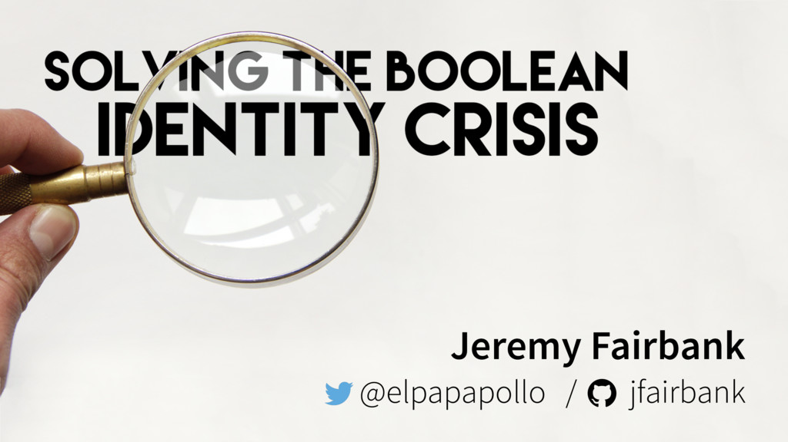
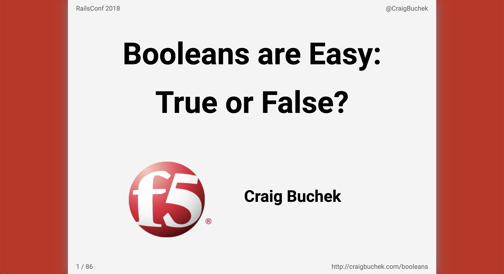

layout: true

<header>
  
Blue Ridge Ruby 2024

  
@CraigBuchek

</header>

<footer>
  
<!-- page numbers -->

  
http://craigbuchek.com/nil

</footer>

---
class: title, middle, center

# Nothing Is Easy, Is It?

## A Talk About Nothing (Nil)

???

* This is a talk I'll be giving next Thursday at Blue Ridge Ruby
* My Twitter is in the upper right corner if you want to tweet at/about me.
    * I'm also on Mastodon, same username, @ruby.social
    * I'm rarely on Twitter any more, nor Mastodon
* AUDIENCE QUESTION: Who has seen a talk on Nil by Sandi Metz or Avdi Grimm?
    * I've got some big boots to fill!

---
class: middle

* Slides: http://craigbuchek.com/nil

* Hit `P` to toggle presenter notes
    * References
    * Details I don't have time to cover

???

* If you want to follow along, or see the slides later, here's the URL.
    * It'll be in the lower right corner.
* Hit `P` for presenter notes.
    * The notes have links to resources I reference in the talk.
    * The notes have more details than I have time to talk about.

* AUDIENCE QUESTION: Who knows the costliest mistake in computer programming?

---
class: middle

> I call it my billion-dollar mistake. It was the invention of the null reference in 1965. [....] This has led to innumerable errors, vulnerabilities, and system crashes, which have probably caused a billion dollars of pain and damage in the last forty years.

  -- Tony Hoare, inventor of null references, 2009

???

* ANSWER: Null pointers
    * According to Tony Hoare (who invented them)
    * It has probably cost businesses several billion dollars over the years
* Also:
    * "I couldn't resist the temptation to put in a null reference"
        * "simply because it was so easy to implement"
* Hoare was also the inventor of the Quicksort algorithm
* He won the Turing Award in 1980
    * The "Nobel Prize" of computer science

------

* Source: https://www.infoq.com/presentations/Null-References-The-Billion-Dollar-Mistake-Tony-Hoare/
* Elided text:

> At that time, I was designing the first comprehensive type system for references in an object oriented language (ALGOL W). My goal was to ensure that all use of references should be absolutely safe, with checking performed automatically by the compiler. But I couldn't resist the temptation to put in a null reference, simply because it was so easy to implement.

---
class: middle, center, image-only

???

* One of my favorite conference talks was by Jeremy Fairbank.
    * He talked about Booleans
    * I wondered how he could talk about true and false for 40 minutes
    * It turned out to be a great talk
    * His talk was about Elm

------

* I highly recommend watching Jeremy's talk.
    * video: [Solving the Boolean Identity Crisis by Jeremy Fairbank](https://www.youtube.com/watch?v=8Af1bh-BVY8)
    * slides: [Slides for "Solving the Boolean Identity Crisis"](https://bit.ly/elm-bool)

---
class: middle, center, image-only

???

* That talk inspired me to give a talk on Booleans
* And **that** talk inspired me to write this talk

------

* In my own opinion, this is the best conference talk I've given
* http://craigbuchek.com/booleans

---
class: agenda

# Agenda

* [Basics](#basics)
* Nil Parameters
* [NoMethodError](#nomethoderror)
* [Other Anti-Patterns](#other-anti-patterns)
* [Solutions](#solutions)
* [Safe Navigation](#safe-navigation)
* [Null Object](#null-object) and [Special Case](#special-case) patterns
* Refactoring
* Type Safety

???

* I'm going to start with the basics
* Then some anti-patterns, and why they're problematic
* Then some better alternatives, and refactoring

---
class: transition, basics

# Basics

???

* On to Ruby!

---

# Basics

~~~ ruby
a = nil
~~~

???

* Nil is pretty simple, right?
* You use it when no other value is valid.

---

# Basics

~~~ ruby
a = nil
a.class
# => NilClass
~~~

???

* `nil` is an instance of a class named `NilClass`.

---

# Basics

~~~ ruby
a = nil
a.object_id
# => 4

c = nil
c.object_id
# => 4
~~~

???

* In fact, there's only 1 instance of `nil`.
* No matter how we get `nil`, it's always the same object.
* Nil's object ID is always 4.
    * Ruby has a few objects that always have the same object_id:
        * false:  0
        * true:   2
        * nil:    4

--

* From the `object_id` documentation: "no two objects will share an id".

---

# Basics

~~~ ruby
NilClass.new
# => NoMethodError: undefined method `new' for NilClass:Class
~~~

???

* You can't create a new instance of NilClass.

---

# Basics

~~~ ruby
NilClass.ancestors
# => [NilClass, Object, Kernel, BasicObject]
~~~

???

* NilClass is a direct descendent of the Object class
    * Most classes in Ruby inherit from Object
* BasicObject is the top of the Ruby object hierarchy
    * It has only 12 methods
        * Mostly just equality and message passing
    * BasicObject is primarily used for creating proxy objects
        * Like the `delegate` method in Rails
        * Messages passed to a proxy object get passed to the target object that it's proxying
            * We want as many methods as possible to be forwarded to the target object of the proxy
* Kernel adds ~50 more methods
    * Mostly for IO, system calls, and process management
    * Methods that seemingly take no receiver
    * Things like:
        * puts, open, readlines
        * sleep
        * require
        * raise, throw, catch
            * These are just (special) methods in Ruby!
        * system, fork
        * binding, caller, class
            * Info about the current context

---

# Basics

~~~ ruby
NilClass.methods - Object.methods
# => []
~~~

???

* NilClass adds no methods other than those inherited from Object

---

# Basics

~~~ ruby
nil.nil?
# => true

false.nil?
# => false

Object.new.nil?
# => false

0.nil?
# => false
~~~

???

* Its only interesting overridden method is `nil?`
    * Which always returns `true` for `nil`
    * Every other Object returns `false`
        * BasicObject doesn't have a `nil?` method
            * It will raise a `NoMethodError`

---

# Basics

~~~ ruby
"this is false" unless nil
# => "this is false"

"this is false" unless false
# => "this is false"

nil == false
# => false

!!nil == false
# => true
~~~

???

* Ruby treats `false` and `nil` as false.
    * Everything else is treated as true.
    * We say that `nil` is "falsey".
* But `nil` and `false` are not equivalent.
    * They are only equivalent when used in a boolean test.
* Unlike "truthy" and "falsey", there is no "nilish" concept in Ruby.

---

# Basics

~~~ ruby
expect(nil).to be_falsey
expect(nil).not_to be_truthy
~~~

???

* You might come across those terms ("truthy" and "falsey") in RSpec tests.

---

# Basics

~~~ ruby
v = nil

"variable is falsey" unless v

"variable is nil" if v.nil?
"variable is empty" if v.empty?

"variable is blank" if v.blank?
"variable is not present" unless v.present?
~~~

???

* The `blank?` and `present?` methods are from Rails' ActiveSupport.
    * Not built into Ruby
    * Commonly used in Rails applications.
* I do not recommend relying on `nil`'s truthiness in `if` statements.
* It's more *idiomatic* to use something more explicitly intention-revealing that returns a Boolean.
    * Like `nil?`, `empty?`, or `blank?`

* This isn't as big a problem in Ruby as in other languages.

* I contend that implicit coercion to Booleans is the 2nd most expensive mistake in computer language design.
    * 0 and empty arrays are equal to false in many languages.

---

# Basics

~~~ ruby
nil.inspect
# => "nil"

nil.to_s
# => ""

nil.to_i
# => 0

nil.to_a
# => []

nil.to_h
# => {}
~~~

???

* Converting `nil` to various types results in an empty or zero value.

---

# NoMethodError

* Raised when a method is called on an object that does not support it
* Nil has only a few methods

~~~ ruby
nil.to_s
# => ""

1.6.ceil
# => 2

nil.ceil
# !> NoMethodError("undefined method `ceil' for nil")
~~~

???

---

# NoMethodError

* Java: NullPointerError (NPE)
* Python: AttributeError
* JavaScript: TypeError
* C: segmentation fault

???

* Other languages have similar errors
    * With similar names
* Note that all of these languages are dynamically typed
* Statically-typed languages catch most of these errors at compile time
    * QUESTION: Isn't Java statically typed?
        * ANSWER: Yes, but it has a special case for `null` that allows it to be assigned to any reference type (per Copilot)

------

~~~ javascript
let x = "abc, def, ghi";
x.split()
# => ["abc,", "def,", "ghi"]

let y = "abc, def, ghi";
y.split()
# !> Uncaught TypeError: x is null
~~~

---
class: transition, solutions

# Solutions

???

* How do we solve these problems?

* More importantly: How do we solve these problems without causing other problems?

---

# Nil Check

* Check for `nil` before calling methods on it

~~~ ruby
user = User.find(123)

unless user.nil?
  puts "Hello, #{user.name}!"
else
  fail "user not found"
end
~~~

~~~ ruby
user = User.find(123)

if user
  puts "Hello, #{user.name}!"
else
  fail "user not found"
end
~~~

???

* The 1st example is more explicit
    * It's more clear that we're checking for `nil`
* The 2nd example is more *idiomatic*, more concise, and more readable
    * Community standards prefer `if` over `unless`
        * Because `unless` is usually harder to read and understand
    * We think of `if user` as "if there is a user"
        * As opposed to the former reading as "unless there is not a user"
* The 2nd example will also raise an exception if `user` is `false`
    * This is rarely a problem
        * It's **extremely** bad practice for a method to return `nil`, `false`, or a "normal" object
            * Unless the object is only returned to represent "truthy"
    * But it is something to be aware of
        * Mostly arises in caching scenarios

---

# Nil Check

* Check for `nil` before calling methods on it

~~~ ruby
user = User.find(123)

if user.nil?
  fail "user not found"
else
  puts "Hello, #{user.name}!"
end
~~~

~~~ ruby
user = User.find(123)

unless user
  fail "user not found"
else
  puts "Hello, #{user.name}!"
end
~~~

???

* These are less idiomatic/readable than the previous examples
* It's idiomatic to put the "positive" case first
    * When using an `if`/`else` statement
    * Because it's easier to read and understand

---

# Nil Check - Trinary

* Check for `nil` using the trinary operator

~~~ ruby
user = User.find(123)

puts user ? "Hello, #{user.name}!" : "Sorry, could not find user"
~~~

~~~ ruby
user = User.find(123)

puts user ? "Hello, #{user.name}!" : fail("user not found")
puts user ? "Hello, #{user.name}!" : fail "user not found"
~~~

???

* Using a trinary operator is often a good choice
    * When the "positive" and "negative" cases are simple

---

# Nil Check - Guard Clause

* Check for `nil` using a guard clause

~~~ ruby
user = User.find(123)
return if user.nil?
puts "Hello, #{user.name}!"
~~~

~~~ ruby
user = User.find(123)
return unless user
puts "Hello, #{user.name}!"
~~~

~~~ ruby
user = User.find(123)
fail "user not found" if user.nil?
puts "Hello, #{user.name}!"
~~~

???

* A guard clause is usually the best solution
* Oddly, in a guard clause, we **have** to cover the "negative" case first
    * Because we don't want to do anything (interesting) in that case
* There's no strong community preference between the first 2
    * Because there's no "double negative" like with `unless user.nil?`
    * Because they're both easy to read and understand
* The 3rd option is appropriate if an exception is the right response

---

# Rescue Nil - DON'T

~~~ ruby
user = User.find(123)
username = company.account.users.first.name rescue "[missing]"
~~~

???

* This looks like a nice solution!
* Don't do this!
    * It will rescue **any** exception
        * Not just `NoMethodError`
    * You should not rescue exceptions you aren't expecting

---

# Safe Navigation

* Ruby 2.3 introduced the safe navigation operator `&.`

~~~ ruby
account = nil

account.owner.address.zip_code
# => undefined method `owner' for nil (NoMethodError)

account&.owner&.address&.zip_code
# => nil
~~~

???

* AKA the "lonely operator"
    * Matz says it looks like a person standing alone, looking around for someone to talk to.
    * The person is looking at the `.` operator.
        * JavaScript and other languages use `?.` for this operator.
* TODO: Show the difference between `&.` and `&&`
* TODO: https://thoughtbot.com/blog/ruby-safe-navigation

---

# Safe Navigation

> Note that `&.` skips only one next call, so for a longer chain it is necessary to add operator on each level

???

* Source: https://docs.ruby-lang.org/en/master/syntax/calling_methods_rdoc.html

---

# Try

* Before the safe navigation operator, Rails had `try`

~~~ ruby
account = nil

account.owner.address.zip_code
# => undefined method `owner' for nil (NoMethodError)

account.try(:owner).try(:address).try(:zip_code)
# => nil
~~~

???

* Rails' ActiveSupport had the `try` method before Ruby had the "safe navigation operator"
* Does `responds_to?` to avoid **any** NoMethodError
* Try is slightly different than the safe navigation operator
    * If the receiver is `false`, the safe navigation operator will return `false`
        * The safe navigation operator treats false as a valid value
    * Try will return `nil` if any of the methods raise an exception
    * It's a method call that uses some metaprogramming
    * It might return `false` instead of `nil` in some cases
    * It can take a block???
    * It can take multiple arguments???
    * It's still useful in some cases

---

# Try

~~~ ruby
account.try(:owner).try(:address).try(:zip_code) { "00000" }
# => "00000"

account && account.owner && account.owner.address
# => false
~~~

???

* TODO: See https://mitrev.net/ruby/2015/11/13/the-operator-in-ruby/
* TODO: See https://stackoverflow.com/a/45825498/26311

---

# Dig

~~~ ruby
address = params[:account].try(:[], :owner).try(:[], :address)
address = params[:account].fetch(:owner) { {} }.fetch(:address)
address = params.dig(:account, :owner, :address)
~~~

???

* TODO: See https://mitrev.net/ruby/2015/11/13/the-operator-in-ruby/

---

# Law of Demeter

* The Law of Demeter is a design guideline for object-oriented programming
* It's often summarized as "only talk to your immediate friends"
    * Don't talk to strangers
    * Don't talk to your friends' friends
    * Don't talk to your friends' friends' friends
* The safe navigation operator is often used to follow the Law of Demeter
* But it's not a silver bullet
    * It can lead to long chains of method calls
    * It can lead to "train wrecks"
* Sometimes it's OK to break the Law of Demeter
    * But it's a code smell
    * It's a sign that you might need to refactor

???

* TODO: More on the Law of Demeter

---
class: transition, root_causes

# Root Causes

---

# Multiple Meanings

* Nil doesn't have a single meaning
* It's often used to represent multiple things
    * Missing value
    * Empty value
    * False
    * Not found
    * Not applicable
    * Not supported
    * Uninitialized / unset variable
    * Failure
    * Default value
    * Sentinel value
    * Placeholder value
    * Empty set

---
class: transition, primitive_obsession

# Primitive Obsession

---

# Primitive Obsession

* Using a primitive type when it'd be better to use a more specialized type

???

* Example: Using a floating point number to represent money
* Example: Using a string to represent a URL
* In Ruby, we're more likely to abuse strings in this way.
    * That's often referred to as "stringly typed".
        * A play on "strongly typed" languages.
    * But this is an example where we've overused booleans.

---

# Primitive Obsession

*

???

* This version still has primitive obsession.
    * We just replaced Boolean primitives with symbol primitives.

---
class: transition, readability

# Readability

???

* Now that we have the proper tools, let's get to work.

---

# Other Billion-Dollar Mistakes

* Implicit coercion to Booleans
* C string libraries
    * Major cause of buffer overflows
* SQL injection
* Bad cryptographic hygiene
* Time zones

???

* There are several other programming mistakes that have likely crossed the billion dollar mark
* Time zones, am I right? :D

---

# Conclusion

---
class: image-only, percent-30

# The Point

???

* The original code we looked at all *worked*.
* So what was the point in changing it?
* We read code more than we write it.
    * So we should optimize for reading.
    * So we should optimize for **understanding**.
* Abstractions are meant to help us understand things.
    * As Sandi says, take the time to find the **right** abstraction.
    * Sometimes that takes some extra work.
* Writing good code might take a little longer in the short run.
    * In the long run, it will pay off to write the code as well as you can.

---

# Conclusions

* Nil isn't always so simple
* Nil is often not the best choice
* Readability matters

???

* I hope I've shown that there's more to Nil than meets the eye.
* But the bigger point is that we can make our code easier to read and understand.
* Take a little time to make it easier for the next person who has to read your code.
    * More often than not, that person will be you.
    * Even if it's not you, helping out your teammates is the right thing to do.

---
class: thanks, image-only

# Thanks

???

* Thank YOU for coming.
* Big thanks to Jeremy Fairbank for inspiring this talk.
* Avdi and Sandi for leading the way
    * And reviewing the talk
* Members of St. Louis Ruby Users group for feedback on a preview of the talk.
* Thanks to Blue Ridge Ruby for selecting my talk.

---

# Feedback

* GitHub: [booch][github]
* Mastadon: [@CraigBuchek@ruby.social][mastadon]
* Twitter: [@CraigBuchek][twitter]
* Email: <craig@boochtek.com>

* Slides: <http://craigbuchek.com/nil>
    * Source: <https://github.com/booch/presentations>

???

* One reason I give talks at conferences is to start a conversation.
* Please don't hesitate to come talk to me any time during the conference.

--

* I used a tool called [Remark][remark] to create and show these slides.

[github]: https://github.com/booch
[mastadon]: https://ruby.social/@CraigBuchek
[twitter]: https://twitter.com/CraigBuchek

[remark]: http://remarkjs.com/
