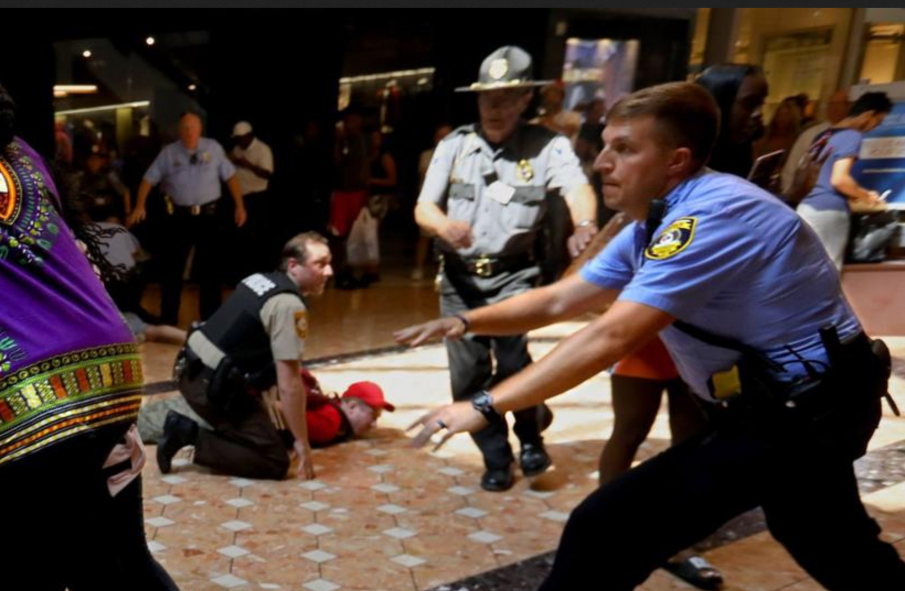

layout: true

<footer>
  
@CraigBuchek

  
craigbuchek.com/stldevfest-2019

</footer>

---
class: title, middle, center

# Passion + Giving = Purpose

### Craig Buchek

???

* Introduction
* Twitter in lower left corner
* Link to slides in lower right corner
* I'm going to tell a story about finding my purpose

---
class: single-image

???

* My story starts on August 9, 2014
* I read a (re)tweet from Angela Harms about a shooting and unrest in Ferguson
    * (She goes by Alex Harms now)
* My first thought was "please don't be Ferguson, Missouri"

* NOTE: This is a recreation of the tweet; I can't find the original

---
class: single-image

???

* I grew up in North St. Louis County
* A few miles Ferguson
* Show of hands - who's familiar with North County?
* My parents' house, where I grew up - purple pin in northeast corner
* Today we're at UMSL - deep blue pin in middle bottom
* Mike Brown shooting - deep red pin in southeast corner of Ferguson

---
class: single-image

???

* There was a record store Chambers and West Florissant
* Me and my best friend from high school (Kai) went there often

---
class: single-image

???

* My grandpa and great-grandfather had barber shops in Ferguson

* NOTE: This picture is just of a generic barber shop

---
class: single-image

???

* I remember visiting my great-grandma there
* My mom said she liked to visit there when she was a kid, because they had squirrels

---
class: single-image

???

* Unfortunately, it *was* Ferguson, Missouri

---
class: single-image

???

* An unarmed 18-year-old black kid had been shot and killed by police
* Michael Brown
* (pause)
* He had just graduated from high school the previous week
* He was supposed to start college at Vatterott the following week

---
class: single-image

???

* Protests broke out across the east portion of Ferguson

* 
* 
* 
* 

---
class: single-image

???

* I was glued to the news for a couple weeks
* I cried several times that week
* I was sad
* I was angry
* I felt helpless
* The only difference between me and the rioters was that I was not oppressed
    * I was a part of the system that supported oppression
* So many people were hurting, feeling oppressed

---
class: single-image

???

* The next Sunday, I went to my dad's church
* Most Holy Trinity Catholic church
* You can see it from I-70 between downtown and North Grand

---
class: single-image

???

* I went to Cahokia Mounds
    * It's a place where I'd found some spiritual connection before
* I was looking for answers
* I was looking for meaning
* I didn't find either

---
class: single-image

???

* On my way home, I was passing by Ferguson
* I decided to stop at the Krispy Kreme at I-270 and West Florissant
* I don't often pass up a donut store
* Traffic was crazy across from the store

---
class: single-image

???

* I'd accidentally stumbled across Mike Brown's funeral service

---
class: single-image

???

* So I bought a dozen donuts
* I ate a couple myself
* I handed out the rest as I walked half a mile from where I had parked

---
class: single-image

???

* The church was packed to overflowing
* I wasn't able to get inside

---
class: single-image

???

* The parking lot was packed with even more people
* They had trucks from radio stations, with speakers for us to hear outside
* I learned a lot that day, listening to and talking to people in the crowd

---
class: big-words, xl

BLACK LIVES MATTER

???

* One of the slogans from the protest movement is "BLACK LIVES MATTER"
* I believe those words to be true

---
class: big-words

BLACK LIVES MATTER AS MUCH AS WHITE LIVES

???

* When we say it, we mean that black lives matter as much as white lives

---
class: big-words

ONLY BLACK LIVES MATTER

???

* Some people think it means this
* But that would be silly for someone like me to believe
* And nobody I know involved in the movement thinks that
* I've asked how people feel about white people participating
* They're happy to have us

---
class: single-image

???

* I marched in a couple protests

---
class: single-image

???

* My brother has been more active than me
* He's one of the ones who got arrested with no provocation or warning at the Galleria
    * (a local shopping mall in a more affluent part of the county)

---
class: single-image

???

* I was there mainly to support the voices who aren't being heard
* Again, I learned a lot
* But I didn't feel like I was really making an impact, or using my talents

---
class: single-image

???

* One of the chants in Ferguson was "hands up, don't shoot"
* (pause)

---
class: single-image

???

* It's clear to me that Mike Brown's hands were up when he was shot
* Here's why I believe that
    * This witness didn't know he was on video, shortly after the shooting
    * He was a contractor working in the area
    * He says "his f'ing hands were up"
* But even if they weren't, police are not judge, jury, and executioner
* There's no good reason to "shoot to kill" an unarmed person

* This is from video at http://www.cnn.com/2014/09/10/us/ferguson-michael-brown-shooting-witnesses/index.html

---
class: single-image, hands-up-united

???

* Several groups formed in response to the shooting
* One was named "Hands Up United"

---
class: single-image

  

???

* ThoughtWorks sent down some of their employees to help the organizers

---
class: single-image

???

* Abby Bobé was one of the main ThoughtWorkers helping

---
class: single-image

???

* Some of the kids volunteering said they wanted to support local businesses, but they couldn't find them on the web
* And phone books weren't a thing any more
* So they decided to figure out how to teach themselves to make web sites for the mom and pop shops in their community

---
class: single-image

???

* Alex Miller tweeted about a GoFundMe page raising money to teach underprivileged kids how to build web sites
* My wife was going to school, so we didn't have much money to give
* But I had time and expertise to share
* It sounded like the perfect role for me
    * It allowed me to apply my experience and skills
    * It felt like something that could make a difference
    * It was so compelling - a calling
* Abby Bobé was the organizer
    * I got in contact with her to help

* NOTE: This is a recreation of the actual (re)tweet; I couldn't find the original

---
class: single-image

???

* Mentoring the kids was awesome
* Hard work and lots of hours
* Had to give up some of the time I spent elsewhere

---
class: single-image

???

* Story about Cameron

---
class: single-image

???

* Story about Cameron

---
class: big-words

I don't know  
Let's find out

???

* Probably the 6 most powerful word I've ever spoken in my life
* Or at least influential

---
class: big-words

OPPORTUNITY

???

* My goal was to give the kids an opportunity that they would not have had otherwise
    * A chance to learn enough to decide if this was a path for them or not
* Opportunity is the biggest thing missing in most of these kids' lives
* They probably don't have the privilege of knowing anyone in their network, or their parents' network that could introduce them to this as a career path
* I didn't expect a very high chance that any of the kids would pursue this as a career
* But some of the kids continued building websites for small companies in their communities, setting up a small side business
* We gave these kids a chance, and they exceeded our expectations

---
class: big-words

COMMUNITY

???

* In the middle of writing this talk, I noticed something interesting

---
class: single-image

???

* I'd met Angela Harms at Midwest Ruby 2011
* (She goes by Alex Harms now)

---
class: single-image

???

* I'd met Alex Miller at local meetups

---
class: single-image

???

* He founded Lambda Lounge and Strange Loop

---
class: single-image

???

* He later had [Idalin Bobé give a keynote](https://www.youtube.com/watch?v=gy82S8tjJX8) at Strange Loop

---
class: single-image

  

???

* ThoughtWorks is a company I've admired for years

---
class: single-image

???

* When I went to RubyConf 2017, Heidi Helfand (from ProCore) asked us about a "peak moment" in our lives to share with a neighbor in the audience
    * Her talk was called "Leadership Starts with Listening"
* That light bulb moment was my story
* I told her that story when we happened to sit at the same table at lunch the next day

---
class: big-words

COMMUNITY

???

* The common thread - these are my communities
* Some I chose, some chose me
* I think this country has forgotten how to be a community
* But I see signs of hope
* The tech community I involve myself in works to make a difference
    * Many of us are trying to improve diversity and inclusion

---

&nbsp;

???

* Andy Croll gave a keynote at RubyConf 2017, showing a pixel for every hour of our lives
    * 24 hours/day * 365 days/year * 80 years/life = 700,800 hours
    * Which is pretty close to the number of pixels on a 1024x768 screen (786,432)
        * Which is also about what a (non-retina) phone screen has

---

&nbsp;

???

* But you're going to sleep 1/3 of that

---

&nbsp;

???

* And you have to spend some time as a kid, growing up
* So you've only got a small number of hours
* So use each pixel wisely
* Find your community
* Find people that are nice and help each other
* Find the place where you can make a difference
* Put in the work, because the rewards are high
    * How you feel about yourself
    * The impact on someone else's life
    * The impact you make to improve the communities you live in
* Make every pixel - every hour - count

---
class: big-words, xl

BLACK LIVES MATTER

???

* Make every person count (whether you've met them or not)
* Reach out to meet people you wouldn't normally cross paths with
* Work to improve our communities
    * This one right here
    * The wider (local) community
    * Our state, our country, our world
