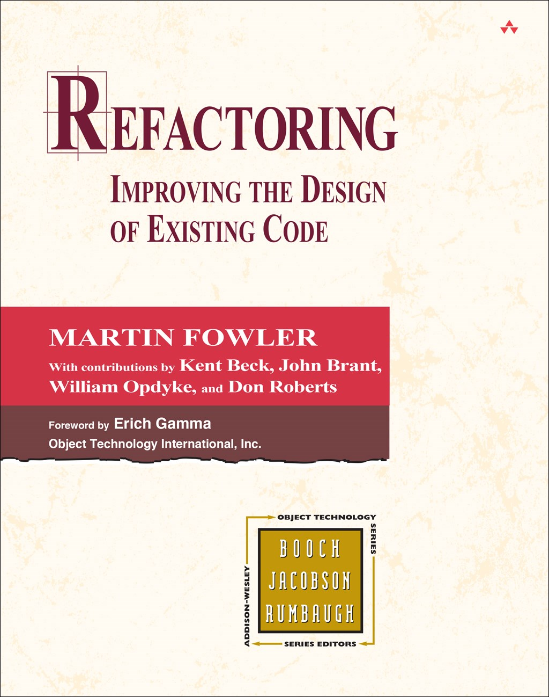
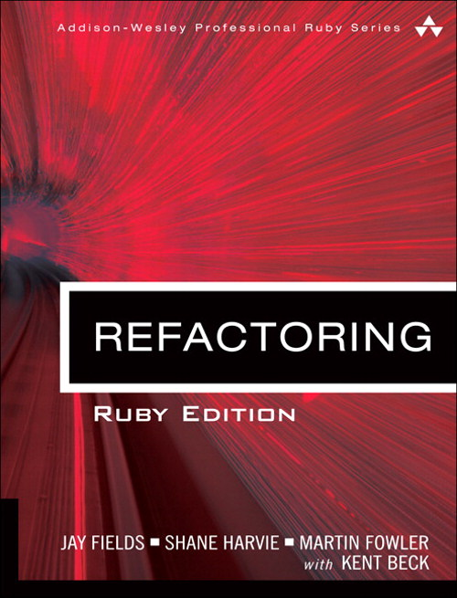
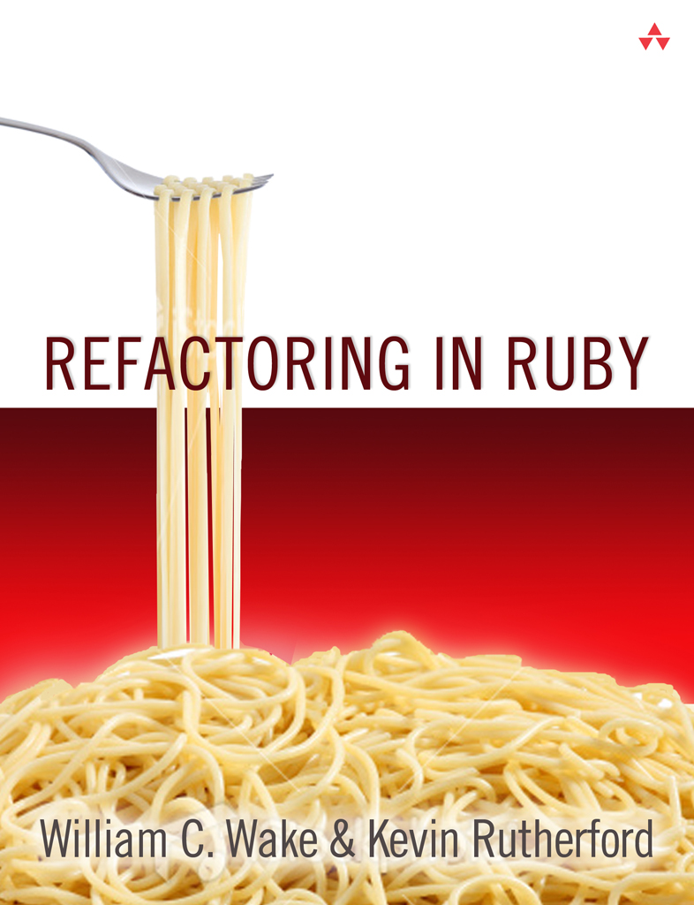

layout: true

<header>
  
STL Ruby

  
2017-03-13

</header>

<footer>
  
@CraigBuchek

</footer>

---
class: title, middle, center

# Refactoring Ruby
### Craig Buchek

???

* Feel free to ask questions during!

---
class: affiliations

# About Me

*  [Craig Buchek][craigbuchek]
*  [BoochTek][boochtek]
*  [This Agile Life][tal]

*  St. Louis
*  [Tech Institute](http://www.handsupunited.org/techimpact/)
*  Ivan

???

* I have a company called BoochTek
    * We do:
        * Web Development
        * Rails rescue projects
        * Agile player/coaching
        * DevOps
* I participate in a podcast called This Agile Life
    * Please subscribe
* I mentor teaching underprivileged kids
* I was told there must be at least 1 cat picture
    * So there's a picture of my cat, Ivan

---

# What Is Refactoring?

Modifying code to improve its internal structure,
without changing its external behavior,
in order to make it easier to understand and cheaper to modify

???

* Note each piece of that:
    * MODIFYING code
    * Improve INTERNAL structure
    * WITHOUT changing behavior
    * Easier to UNDERSTAND
    * CHEAPER to modify
* Note that NOT all clean-up and restructuring is _refactoring_
    * We often use the term incorrectly

---

# History of Refactoring

* Term first used by Ralph Johnson in 1990
* Popularized by Extreme Programming in 1999
* Martin Fowler's book written in 1999

???

* Ralph Johnson is also one of the "Gang of Four" that wrote the _Design Patterns_ book
* Sources:
    * http://wiki.c2.com/?HistoryOfRefactoring
    * https://en.wikipedia.org/wiki/Code_refactoring

---
class: single-image

# Refactoring - Canonical Reference

---
class: single-image

# Refactoring - Ruby Edition

---
class: single-image

# Refactoring - The Other Ruby Book

???

* I can't say as much about this book
    * I own it, but don't recall reading it

---

# Why Refactor?

* Readability
* Simplification
    * DRY - don't repeat yourself
* Improved extensibility
* Maintainability
* Reduced bugs

???

* Reducing bugs can come about in a few ways:
    * By improving readability, you find the code does not match the intent
    * By simplifying, you find incorrect edge cases
    * By DRYing up, you find not all copies are the same

---

# When To Refactor

* Before making requested changes
    * To clarify what's going on
* After adding requested changes
    * Red, Green, Refactor

---

# What Do I Need To Be Able To Refactor?

* Tests for the code in question
* Knowing what refactorings are available
* Automated refactoring tools (optional)

???

* You need tests to have confidence that you're not breaking the code
    * PRO-TIP: Run tests before **and** after your changes
* IDEs often provide **some** automated refactorings

---

# Refactorings Have Names

* Extract Method
* Move Method
* Extract Variable
* Inline Temp
* Replace Parameter with Method

[Catalog of refactorings](https://refactoring.com/catalog/)

???

* These are just a few of nearly 100 documented refactorings

---

# How Do I Know What To Refactor?

* Code "smells"
* Heuristics
    * Sandi Metz's rules

---

# Code Smells

* Duplicated code
* God class
* Feature envy
* Too many parameters
* Long method
* Comment

???

* A smell is something that indicates that there **MAY** be a problem
* Like refactorings, code smells have names
* Each smell has a corresponding refactoring or small set of refactorings
* There are also "design smells" for problems with higher-level designs
    * These usually require restructure that is NOT refactoring
* Coined by Kent Beck in 1999
* Comments are an odd/controversial smell
    * They're often used to cover up bad smells
    * Refactoring will often remove the need for the comment
    * Amos and I have had drawn-out "discussions" about this!
    * Fowler has this to say:
    ~~~
    Don’t worry, we aren’t saying that people shouldn’t write
    comments. In our olfactory analogy, comments aren’t a bad smell,
    indeed they are a sweet smell.
    The reason we mention them here is because comments are often
    used as a deodorant. It’s surprising how often you look at
    thickly commented code, and notice that the comments are there
    because the code is bad.
    Thus comments lead us to bad code that has all the rotten whiffs
    we’ve discussed in the rest of this chapter. Our first action to
    remove the bad smells by refactoring. When we’re done we often
    find that the comments are now superfluous.
    ~~~

---

# Sandi Metz's Rules

1. Classes should be no longer than 100 lines of code
2. Methods should be no longer than 5 lines of code
3. Methods should take no more than 4 parameters
    * Hash options count as parameters
4. Rails views should receive only 1 object from the controller
5. Rails controller actions should know only 2 other class names
6. Break the rules only if you can convince your pair

???

* The purpose is "to reduce the cost of software"
    * "The best way to do this is to make small objects"
* Sandi says maybe it should be 3 parameters per method
* The 2 classes that a controller action should know are:
    * A business-logic class
    * A presenter class
* There's even a Ruby gem that will check your code to see if it meets Sandi's rules
    * https://github.com/makaroni4/sandi_meter
* Sources:
    * https://www.youtube.com/watch?v=npOGOmkxuio
    * https://speakerdeck.com/triangleruby/sandi-metz-rules
    * https://robots.thoughtbot.com/sandi-metz-rules-for-developers#100-line-classes

---

# Smaller Methods - Booleans

* Original

~~~ ruby
def deletable?
  if sequential_approvers_enabled?
    !answered?
  else
    true
  end
end
~~~

???

* Amos said:
    ~~~
    The `deletable?` logic here seemed a little strange to me.
    So I converted it to straight logic to see what is going on.

        a = sequential_approvers_enabled?
        b = answered?

    The above condition is equivalent to:

        (a && !b) || !a # applying the distribution property of the ||
        (a || !a) && (!b || !a) # side one is a tautology
        true && (!b || !a) # we can drop the true because true && c is always c
        (!b || !a) # applying De Morgan's Theorem
        !(b && a) # we can also use the commutative property to swap those just to look more like the original
        !(a && b)
    ~~~

---

# Smaller Methods - Booleans

* Amos's partial refactoring

~~~ ruby
def deletable?
  !(sequential_approvers_enabled? && answered?)
end
~~~

OR

~~~ ruby
def deletable?
  !sequential_approvers_enabled? || !answered?
end
~~~

---

# Smaller Methods - Booleans

* Amos's suggested refactoring

~~~ ruby
def deletable?
  sequential_approvers_disabled? || unanswered?
end

def unanswered?
  !answered?
end

def sequential_approvers_disabled?
  !sequential_approvers_enabled?
end
~~~

---
class: thanks

# Thanks

???

* Thank YOU for coming

---

# Feedback

* Twitter: [@CraigBuchek][twitter]
* GitHub: [booch][github]
* Email: craig@boochtek.com

* Slides: https://github.com/booch/presentations/
    * [Remark][remark] presentation software

???

* Credits:
    * Clip art from Clipart.co
* Presentation software:
    * [Remark][remark]

[twitter]: https://twitter.com/CraigBuchek
[github]: https://github.com/booch
[github-boochtek]: https://github.com/boochtek
[craigbuchek]: http://craigbuchek.com
[boochtek]: https://www.boochtek.com
[tal]: http://www.thisagilelife.com

[remark]: http://remarkjs.com/
