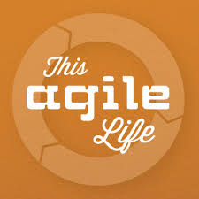

layout: true

<header>
  
STL Ruby

  
2017-03-13

</header>

<footer>
  
@CraigBuchek

</footer>

---
class: title, middle, center

# Refactoring Ruby
### Craig Buchek

???

* Feel free to ask questions during!

---
class: affiliations

# About Me

*  [Craig Buchek][craigbuchek]
*  [BoochTek][boochtek]
*  [This Agile Life][tal]

*  St. Louis
*  [Tech Institute](http://www.handsupunited.org/techimpact/)
*  Ivan

???

* I have a company called BoochTek
    * We do:
        * Web Development
        * Rails rescue projects
        * Agile player/coaching
        * DevOps
* I participate in a podcast called This Agile Life
    * Please subscribe
* I mentor teaching underprivileged kids
* I was told there must be at least 1 cat picture
    * So there's a picture of my cat, Ivan

---

---
class: thanks

# Thanks

???

* Thank YOU for coming

---

# Feedback

* Twitter: [@CraigBuchek][twitter]
* GitHub: [booch][github]
* Email: craig@boochtek.com

* Slides: https://github.com/booch/presentations/
    * [Remark][remark] presentation software

???

* Credits:
    * Clip art from Clipart.co
* Presentation software:
    * [Remark][remark]

[twitter]: https://twitter.com/CraigBuchek
[github]: https://github.com/booch
[github-boochtek]: https://github.com/boochtek
[craigbuchek]: http://craigbuchek.com
[boochtek]: https://www.boochtek.com
[tal]: http://www.thisagilelife.com

[remark]: http://remarkjs.com/
