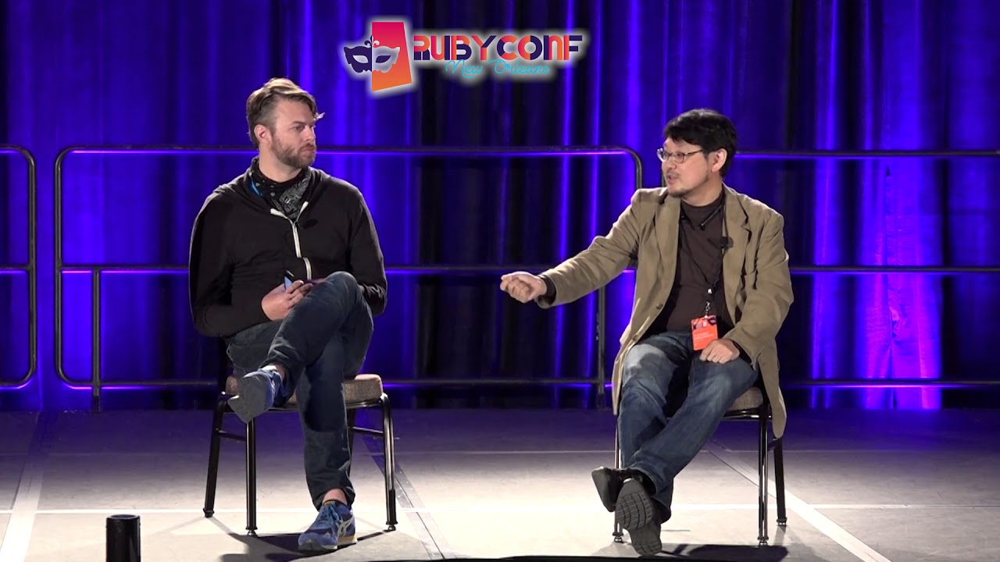

layout: true

<header>
  
STL Ruby - October 2018

  
@CraigBuchek

</header>

<footer>
  
<!-- page numbers -->

  
http://craigbuchek.com/ruby-reimagined

</footer>

---
class: title, middle, center

# Ruby Reimagined

### Craig Buchek

---
class: middle

* Slides: http://craigbuchek.com/ruby-reimagined

* Hit `P` to toggle presenter notes
    * References
    * More details than I will talk about

???

* If you want to follow along, or see the slides later, here's the URL.
    * It'll be in the lower right corner.
* Hit `P` for presenter notes.
    * Notes have links to things I reference.
    * Notes have more info than I'll talk about in some cases.
* My Twitter is in the upper right corner if you want to tweet at/about me.

---
class: middle, center, craig-heart-ruby

 +  = 

???

* I love Ruby.
* I've been using Ruby since 2005.
* I'm not sure I'll ever like another language as much as Ruby.
    * I'm writing my own language.
        * I'm not even confident I'll like *it* more than Ruby.

---
class: image-only

???

* I first came up with the idea for this talk while attending Emerging Languages Camp.
    * In 2013.
        * ELC was co-located with Strange Loop in 2012 and 2013.
            * I don't think I attended in 2012.
* Basically some thought experiments about what Ruby would have looked like if designed today.
    * What if Matz had made some different choices?
    * Especially big things like immutability, types, and concurrency.

---
class: image-only

???

* The next time I thought about it was at RubyConf.
    * Matz was answering a question about what features he regretted adding to Ruby.

---
class: image-only

???

* I've also been thinking for quite a while about programming language design.
* Not in an academic sense, but what works practically for programmers.
* Since I love Ruby, my language design starts there, but diverges in some significant ways.
* This talk is NOT about Stone.
    * It's about more realistic changes that might be applied to Ruby.

---
class: middle, center, craig-heart-ruby

 +  = 

???

* So I love Ruby.

---

# But...

???

* But not EVERYTHING about Ruby.
* Ruby has some things that aren't so great.

---

# What Was Matz Thinking?

~~~ ruby
$foo = 123
$: << "./lib"  # Add a directory to the load path.
$LOAD_PATH  # See the load path.
$*  # ARGV (command-line arguments).
%w[a b c].join  # => "abc"
$, = ", "  # Set join string.
%w[a b c].join  # => "a, b, c"
$_  # Last line read via `gets` or `readline`.
~~~

???

* In general, global variables are frowned upon.
    * They lead to non-local effects.
        * Breaks encapsulation.
        * Makes things very difficult to troubleshoot.
    * Global constants are fine -- they don't have most of the issues.
* That last one isn't technically even global.
    * It's one of a few that are lexically scoped.
* Perl-style (symbolic) globals are especially ugly.
    * If you *have* to use them, use the English variants.
        * Now included automatically.
            * Used to have to `require "english"` to get them.
        * See https://ruby-doc.org/stdlib-2.0.0/libdoc/English/rdoc/English.html.
* See https://ruby-doc.org/core-2.5.1/doc/globals_rdoc.html for the full list.

---

# What Was Matz Thinking?

~~~ ruby
=begin
This is a comment.
=end

def my_method
  =begin
  This is NOT a comment.
  The `=begin` is a syntax error.
  =end
end
~~~

???

* Ruby has block comments, but they're ugly and hard to use.
    * So weird - they have to start at the beginning of the line.
* Has anyone here ever used these?
* Who even knew these existed?

* Surprisingly, Atom knows how to correctly syntax highlight them.
    * The syntax highlighting in the presentation doesn't get it quite right.

---

# What Was Matz Thinking?

~~~ ruby
puts DATA.read
__END__
The interpreter will ignore all of this text.
This will be part of the output.
Everything to the end of the file is part of `DATA`.
~~~

???

* This program will print lines 3 through 5.
* Note that you can only have 1 data block in a file.
    * It always reads EVERYTHING from __END__ to the end of the file.
* I can see a use for data blocks, but they're kinda weird.
    * Why not just load the text from a separate file?
* Who knew about this feature?
    * How often have you used it?

---

# What Was Matz Thinking?

~~~ ruby
class Polygon
  @@sides = 10
  def self.sides
    @@sides
  end
end

Polygon.sides # => 10

class Triangle < Polygon
  @@sides = 3
end

Triangle.sides # => 3
Polygon.sides # => 3
~~~

???

* Class variables aren't very useful.
    * They interact poorly with inheritance.
    * They're shared between the class and all its subclasses.
* Class variables are available to both instance methods and class methods.

---

# What Was Matz Thinking?

~~~ ruby
class Polygon
  @sides = 10
  def self.sides
    @sides
  end
end

Polygon.sides # => 10

class Triangle < Polygon
  @sides = 3
end

Triangle.sides # => 3
Polygon.sides # => 10
~~~

???

* Use "class instance variables" instead.
    * Note that they can only be referenced from class methods.

---

# Planned Obsolescence

~~~ ruby
for i in 1..6
  puts i
end

(1..6).each do |i|
  puts i
end

1.upto(6).each do |i|
  puts i
end
~~~

???

* How many times have you used `for` / `in` in the past year?
    * I've not used it once I learned about `each`.
    * I'm not even planning to put `for` loops in my own Ruby-derived language.

---

# Planned Obsolescence

~~~ ruby
END { puts "END" }
puts "hello"
BEGIN { puts "BEGIN" }

# Prints "BEGIN", then "hello", then "END".
~~~

???

* Has anyone ever used `BEGIN` or `END`?
* They're used to run code before/after the program starts/finishes.
* A program may include multiple BEGIN and END blocks.
    * `BEGIN` blocks are executed in the order they are encountered.
    * `END` blocks are executed in reverse order.
* Usually used when using Ruby to process text like Awk.
    * I.e. when running `ruby -n`.
        * Puts an implicit `while gets(); ... end` around the code.

---

# Planned Obsolescence

Ruby 2.0+

~~~ ruby
?a  # => "a"
?a + ?b  # => "ab"
?a.class  # String
??  # => "?"
?\t  # => "\t"
?\111  # => "I" (octal)
?\C-x  # => "\u0018" (control-X)
~~~

Ruby 1.8

~~~ ruby
?a  # => 65 #TODO: Check this
?a + ?b  # => "ab" #TODO: Check this
?a.class  # Character #TODO: Check this
"test"[0]  # 116
~~~

???

* Character literals are just strings in Ruby 1.9 and newer.
* They used to be Integers.

---

# Planned Obsolescence

* Procs (in favor of lambdas)

---

# Hmm...

* Autoloading

---

# But...

???

* Matz does not want to break backwards compatibility.
    * He's quite worried about the "Python 3 effect".

---

# Immutable strings

~~~ ruby
s = "Hello, Craig"
s.gsub("Craig", "Ruby!")
s  # => "Hello, Craig"
s.gsub!("Craig", "Ruby!")
s  # => "Hello, Ruby!"
~~~

~~~ ruby
s = "Hello, Craig".freeze
s.gsub!("Craig", "Ruby!") #! FrozenError: can't modify frozen String
~~~

~~~ ruby
# frozen_string_literal: true
s = "Hello, Craig"
s.gsub!("Craig", "Ruby!")  #! FrozenError: can't modify frozen String
buffer = ""
buffer << "Craig"  #! FrozenError: can't modify frozen String
buffer += "Craig"
buffer  # => "Craig"
~~~

???

* TODO: Talk about `freeze`.
* We have immutable strings as of Ruby 2.3 -- sort of.
    * Requires a "magic" comment.
        * Note that it's **singular** `literal`.
            * Which I can never remember.
    * Or `--enable-frozen-string-literal` from command line.
        * But that will break **many** existing gems.
    * Might become the default in Ruby 3.0.
* TODO: This is actually **only** string literals.
    * I'm actually talking about *all* strings.

---

# Immutable Arrays and Hashes

~~~ ruby
h = {a: 1, b: 2}
h[:a]  # => 1
h[:a] = 2
h[:a]  # => 2
~~~

???

---

# Static Null Checking

???

* Like Crystal

---

# HashWithIndifferentAccess

* Crystal's solution

---

# Auto-initializing Variables

* `@` in parameters list
* Like CoffeeScript and Crystal

---

# First-class Blocks

---

# Concurrency

* concurrent-ruby
* Erlang/Elixir concurrency model

---

# Pipes

* F#, Elixir, Elm

~~~ ruby
g(f(x))
f(x) |> g
~~~

---

# Pattern matching / Destructuring

---

# Tail call optimization

---

# Type Checking

* Various attempts
    * TODO: List main ones
        * Stripe's
        * Previous attempts (from previous Strange Loop)
        * MRI 3.0
* TypeScript

---

# Object#in?

* Not having this is a pet peeve of mine

---

# Annotations

* We actually already kind of have this, but could use it more

---

# The Future

* What might Ruby evolve to?
* What are some possible paths forward?
* How can we make Ruby better?
* How can we derive more joy from programming?

???

* I'd like to advocate for a faster pace of changes.
    * So that Rubyists don't feel like we're stuck with trailing edge tech.

---

---

# Feedback

* Twitter: [@CraigBuchek][twitter]
* GitHub: [booch][github]
* Email: craig@boochtek.com

* Slides: http://craigbuchek.com/ruby-reimagined
    * Source: https://github.com/booch/presentations

???

* I'm hoping to refine this and give it at a conference.
    * So please give me feedback.

------

* I used a tool called [Remark][remark] to create and show these slides.

[twitter]: https://twitter.com/CraigBuchek
[github]: https://github.com/booch
[github-boochtek]: https://github.com/boochtek
[craigbuchek]: http://craigbuchek.com
[boochtek]: https://www.boochtek.com
[tal]: http://www.thisagilelife.com

[remark]: http://remarkjs.com/
