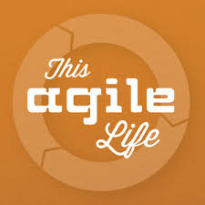
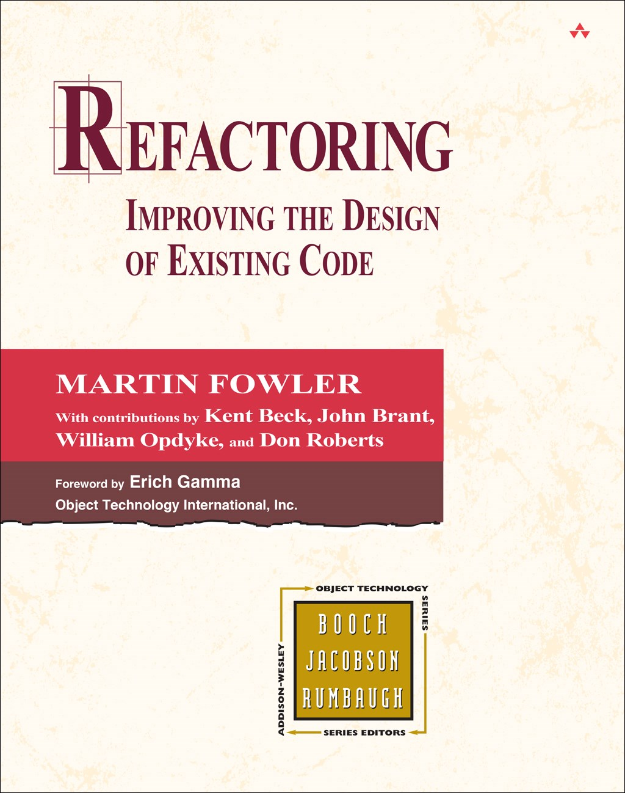

layout: true

<header>
  
AATC2017

  
2017-04-21

</header>

<footer>
  
@CraigBuchek

</footer>

---
class: title, middle, center

# Smaller!
### Craig Buchek

http://boochtek.com/aatc2017

???

* Original title was "Keep it Short"
    * But this title is shorter
* Feel free to ask questions during!
* That's the URL for the slides
    * Hit `p` for presenter notes
    * Notes have more info than I'll talk about in some cases

-----

* Image from http://smurfsfanon.wikia.com/wiki/Smurfs_%28LD_Stories%29

---
class: affiliations

# About Me

*  [Craig Buchek][craigbuchek]
*  [BoochTek][boochtek]
*  [This Agile Life][tal]

???

* I'm currently between gigs
    * I fix "broken" teams
    * I fix messes people have made of their code
    * I'm a "player/coach"
        * I join teams and help them find how to improve
        * I don't want to just tell people what to do
* I have a company called BoochTek
    * We do:
        * Rails rescue projects
        * Web Development
        * Agile coaching
        * DevOps / automation
* I do a podcast called This Agile Life
    * Please subscribe

---
class: single-image

# Obligatory Cat Picture

???

* Here's my cat, Ivan

---

# Smaller - Why?

* Focus on what's valuable
* Focus on task at hand
    * It's easier to focus on smaller things
    * We get bored when we work too long on a single thing
* Builds momentum
* Easier to modify
* Easier to throw away
* Smaller code usually runs faster
    * Does less
    * Fits in cache better

???

* Focus on what's valuable
    * Minimum Viable Product (MVP)
    * Minimal Marketable Feature (MMF)
* Agile techniques help me focus
* Momentum - sense of accomplishment that you can build on
* We refactor to make future changes less expensive
    * More time is spent reading and understanding code than writing it
* Sandi Metz quote:
    * The purpose (of refactoring) is "to reduce the cost of software"
        * "The best way to do this is to make small objects"

---

# Smaller - What?

* Stories
* Tests
* Methods
* Classes
* Commits
* Releases

---

# Smaller - How?

* Story splitting
* Better tests
* Refactoring
* Discipline

---

# Smaller Stories - Why?

* Smaller stories can be estimated more easily
* Smaller stories can be completed quicker
    * Delivers value quicker
    * Making quicker progress leads to more progress
* It's easier to realize you don't need a smaller story

---

# Smaller Stories - How?

* Thin vertical slices
* Story splitting
* Minimal Marketable Feature (MMF)
* One acceptance criteria per story
* INVEST
    * Independent
    * Negotiable
    * Valuable
    * Estimable
    * Small
    * Testable

???

* Thin vertical slice - implement full stack, but narrow functionality
    * Exception - you can implement API first, if it's useful by itself

-----

* More info on INVEST:
    * http://wiki.c2.com/?InvestModelForUserStories
    * https://en.wikipedia.org/wiki/INVEST_%28mnemonic%29

---
class: single-image

# Vertically Sliced Increments

???

-----

* Image from [Henrik Kniberg](http://blog.crisp.se/2016/01/25/henrikkniberg/making-sense-of-mvp)

---

# Thin Vertical Slices - Login

~~~
As a user,
I want to log in,
So that I can use the app

Given an existing user account
When I log in with correct credentials
Then I should be logged in

Given an existing user account
When I log in with incorrect credentials
Then I should see an error message
And I should not be logged in
~~~

???

* Right away, the premise is wrong
    * The user does NOT want to log in; they just want to use the site
        * The user might want to log in to keep their info private
        * The site owner might want the user to log in to track them
* But this is a GOOD example of thin vertically-sliced stories

-----

* Good explanations of **how** to split stories:
    * http://techblog.holidaycheck.com/brilliant-ways-to-slice-user-stories/
    * http://agileforall.com/wp-content/uploads/2009/10/Story-Splitting-Cheat-Sheet.pdf
* Other good examples of story splitting:
    * https://gojko.net/2012/01/23/splitting-user-stories-the-hamburger-method/
    * https://confengine.com/agile-india-2015/proposal/880/techniques-for-effectively-slicing-user-stories

---

# Thin Vertical Slices - Point of Sale

~~~
As a customer,
I want to buy something from the store,
So that I can take it home and use it

When I take something to the cash register
And the cashier rings it up
Then the cash register should look up the price
And tax should be added
And I should be able to pay by cash, check, or credit card
And a receipt should be printed
And inventory should be updated
~~~

???

* Consider breaking each `Then` (`And`) into its own story
    * At the least, start with 1 `Then`, adding another only after you finish the previous
* In this example, determine what steps can be done manually for a short time

---

# Smaller Tests

* Arrange, Act, Assert
    * Do as little as possible in each step
* One assertion per test

---

# Smaller Methods

* Should do one thing
* Use more declarative terms
* Don't have methods that pre-compute values
    * Just ask for the value when you need it
        * Memoize if necessary
    * Don't pretend to tell when you're asking
        * Don't use `get` or `compute` methods

---

# Smaller Classes

* Single Responsibility Principle (SRP)
    * A class should have only one reason to change

---

# Refactoring

Modifying code to improve its internal structure,
without changing its external behavior,
in order to make it easier to understand and cheaper to modify

???

* Here's a good definition of "refactoring"
* Note each piece of the definition

-----

* Term first used by Ralph Johnson in 1990
    * Part of "Gang of Four" that wrote the _Design Patterns_ book
    * Popularized by Extreme Programming in 1999
* Sources:
    * http://wiki.c2.com/?HistoryOfRefactoring
    * https://en.wikipedia.org/wiki/Code_refactoring

---

# Refactoring

<b>Modifying</b> code to improve its internal structure,
without changing its external behavior,
in order to make it easier to understand and cheaper to modify

---

# Refactoring

Modifying code to improve its <b>internal</b> structure,
without changing its external behavior,
in order to make it easier to understand and cheaper to modify

---

# Refactoring

Modifying code to improve its internal structure,
<b>without</b> changing its external behavior,
in order to make it easier to understand and cheaper to modify

---

# Refactoring

Modifying code to improve its internal structure,
without changing its external behavior,
in order to make it easier to <b>understand</b> and cheaper to modify

---

# Refactoring

Modifying code to improve its internal structure,
without changing its external behavior,
in order to make it easier to understand and <b>cheaper</b> to modify

???

* Note that NOT all clean-up and restructuring is _refactoring_
    * We often use the term incorrectly
    * https://martinfowler.com/bliki/RefactoringMalapropism.html

---
class: single-image

# Refactoring - Canonical Reference

???

* Written in 1999
    * Still the canonical book on the topic
* There are a couple other good books on refactoring
    * Refactoring Ruby Edition
    * Refactoring Workbook

-----

* https://martinfowler.com/books/refactoring.html

---

# Why Refactor?

* Readability
* Simplification
    * DRY - Don't Repeat Yourself
    * SRP - Single Responsibility Principle
* Improved extensibility
* Maintainability
* Reduced bugs
* Improved performance

???

* Reducing bugs can come about in a few ways:
    * By improving readability, you find the code does not match the intent
    * By simplifying, you find incorrect edge cases
    * By DRYing up, you find not all copies are the same
* Small code often performs better
    * Does less work
    * Fits in cache better
* SRP
    * A class should have only one reason to change
    * Each class and method should be responsible for one thing

---

# When To Refactor

* Before making requested changes
    * To clarify what's going on
* After adding requested changes
    * Red, Green, Refactor
* When you realize you've got too much tech debt
* When you see something that's a problem

???

* Red, Green, Refactor comes from Test-Driven Development
    * Write a failing test
        * Make sure the test fails before writing the code
            * So you know that the test **will** fail
    * Make the test pass
        * Write the simplest code that you can to make the test pass
    * Refactor the code
        * Clean up any duplication or any other issues
* The Boy Scout rule - leave the code better than you found it
    * https://martinfowler.com/bliki/OpportunisticRefactoring.html
* As a general rule, **DO NOT** refactor a file that you're not otherwise touching

---

# What Do I Need to Refactor?

* Knowing what code needs refactoring
* Tests for the code in question
* Knowing what refactorings are available
* Automated refactoring tools (optional)

???

* You need tests to have confidence that you're not breaking the code
    * PRO-TIP: Run tests before **and** after your changes
* IDEs often provide **some** automated refactorings

---

# Refactorings Have Names

* Extract Method
* Move Method
* Extract Variable
* Inline Temp
* Replace Parameter with Method

Catalog of refactorings: https://refactoring.com/catalog/

???

* These are just a few of nearly 100 documented refactorings

---

# How Do I Know What To Refactor?

* Code "smells"
* Heuristics
    * Sandi Metz's rules
* Your own _gut feelings_ from experience
* Test "smells"

---

# Code Smells

* Duplicated code
* God class
* Feature envy
* Too many parameters
* Long method
* Comment

???

* A smell is something that indicates that there **MAY** be a problem
* Like refactorings, code smells have names
* Each smell has a corresponding refactoring or small set of refactorings

-----

* There are also "design smells" for problems with higher-level designs
    * These usually require restructuring that is NOT refactoring
* Coined by Kent Beck in 1999

---

# Code Smells

* Duplicated code
* God class
* Feature envy
* Too many parameters
* Long method
* Comment

???

* A God class is a class that tries to do way too much
    * Usually your `User` class
    * Sometimes a class named similar to the name of the app

---

# Code Smells

* Duplicated code
* God class
* Feature envy
* Too many parameters
* Long method
* Comment

???

* Feature envy is when one class is doing work that should be done in another class

---

# Code Smells

* Duplicated code
* God class
* Feature envy
* Too many parameters
* Long method
* Comment

???

* Comments are an odd/controversial smell
    * They're often used to cover up bad smells
    * Refactoring will often remove the need for the comment
    * Ive had drawn-out "discussions" about this!
    * Fowler has this to say:
    ~~~
    Don’t worry, we aren’t saying that people shouldn’t write
    comments. In our olfactory analogy, comments aren’t a bad smell,
    indeed they are a sweet smell.
    The reason we mention them here is because comments are often
    used as a deodorant. It’s surprising how often you look at
    thickly commented code, and notice that the comments are there
    because the code is bad.
    Thus comments lead us to bad code that has all the rotten whiffs
    we’ve discussed in the rest of this chapter. Our first action to
    remove the bad smells by refactoring. When we’re done we often
    find that the comments are now superfluous.
    ~~~

---

# Test Smells

* Too many collaborators
* Tests mirror code too closely
* Fragile tests
* Slow tests

* If your tests are hard to write, your code is probably too complex

???

* Your tests will often indicate problems as well
* These are probably less well-documented than code smells
    * "XUnit Test Patterns" has a decent amount documented
        * And the corresponding http://xunitpatterns.com/
    * Decent examples to work through at https://github.com/testdouble/test-smells

---

# Sandi Metz's Rules

1. Classes should be no longer than 100 lines of code
2. Methods should be no longer than 5 lines of code
3. Methods should take no more than 4 parameters
    * Hash options count as parameters
4. Break the rules only if you can convince your pair

???

* These were specifically about Ruby
    * Ruby is a terse language
    * Could/should be modified for other languages
        * But I wouldn't go past 10 lines / 200 lines / 5 parameters
* Common joke: If your method takes 10 parameters, you probably missed one!

-----

* Sandi says maybe it should be 3 parameters per method
* There are 2 more rules, specific to Rails:
    4. Views should receive only 1 object from the controller
    5. Controller actions should know only 2 other class names
        * A business-logic class
        * A presenter class
* Sources:
    * https://www.youtube.com/watch?v=npOGOmkxuio
    * https://speakerdeck.com/triangleruby/sandi-metz-rules
    * https://robots.thoughtbot.com/sandi-metz-rules-for-developers#100-line-classes

---

# When Am I Done Refactoring?

* When code is as clear as possible
    * Never?
* You're likely **not** overdoing it
* When every method is 1 line long
    * With no `if`s
* When you meet the Sandi Metz metrics
* When you meet the Four Rules of Simple Design
    * Passes the tests
    * Reveals intention
    * No duplication
    * Fewest elements

???

* Good article on function length: https://martinfowler.com/bliki/FunctionLength.html
* Four Rules of Simple Design
    * https://martinfowler.com/bliki/BeckDesignRules.html
    * Book by Corey Haines: https://leanpub.com/4rulesofsimpledesign

---

# Smaller Methods - Booleans

* Original

~~~ ruby
def deletable?
  if sequential_approvers_enabled?
    !answered?
  else
    true
  end
end
~~~

???

* Amos said:
    ~~~
    The `deletable?` logic here seemed a little strange to me.
    So I converted it to straight logic to see what is going on.

        a = sequential_approvers_enabled?
        b = answered?

    The above condition is equivalent to:

        (a && !b) || !a # applying the distribution property of the ||
        (a || !a) && (!b || !a) # side one is a tautology
        true && (!b || !a) # we can drop the true because true && c is always c
        (!b || !a) # applying De Morgan's Theorem
        !(b && a) # we can also use the commutative property to swap those just to look more like the original
        !(a && b)
    ~~~

---

# Smaller Methods - Booleans

* Amos's partial refactoring

~~~ ruby
def deletable?
  !(sequential_approvers_enabled? && answered?)
end
~~~

OR

~~~ ruby
def deletable?
  !sequential_approvers_enabled? || !answered?
end
~~~

---

# Smaller Methods - Booleans

* Amos's suggested refactoring

~~~ ruby
def deletable?
  sequential_approvers_disabled? || unanswered?
end

def unanswered?
  !answered?
end

def sequential_approvers_disabled?
  !sequential_approvers_enabled?
end
~~~

---

# Smaller Commits - Why?

* Rolling back an atomic unit
* `git bisect`

---

# Smaller Releases - Why?

* Less to go wrong
* Practice makes perfect

---

# Smaller Releases - How?

* Build confidence with customers and management
* Release bug fixes "out of band"
* Show that smaller changes are less risky
* Keep decreasing time between releases

---

# Exceptions to the Rule

* Commit messages
* Others?

???

* Amos says that commit messages should be longer than a Tweet

---
class: workshop

# Workshop

https://github.com/boochtek/aatc2017

---
class: thanks

# Thanks

???

* Thank YOU for coming

---

# Feedback

* Twitter: [@CraigBuchek][twitter]
* GitHub: [booch][github]
* Email: craig@boochtek.com

* Slides: http://boochtek.com/aatc2017
    * [Remark][remark] presentation software

[twitter]: https://twitter.com/CraigBuchek
[github]: https://github.com/booch
[github-boochtek]: https://github.com/boochtek
[craigbuchek]: http://craigbuchek.com
[boochtek]: https://www.boochtek.com
[tal]: http://www.thisagilelife.com

[remark]: http://remarkjs.com/
