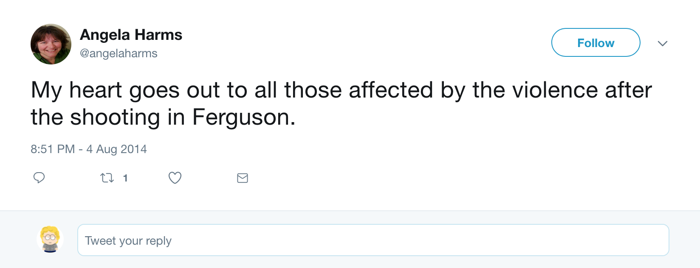
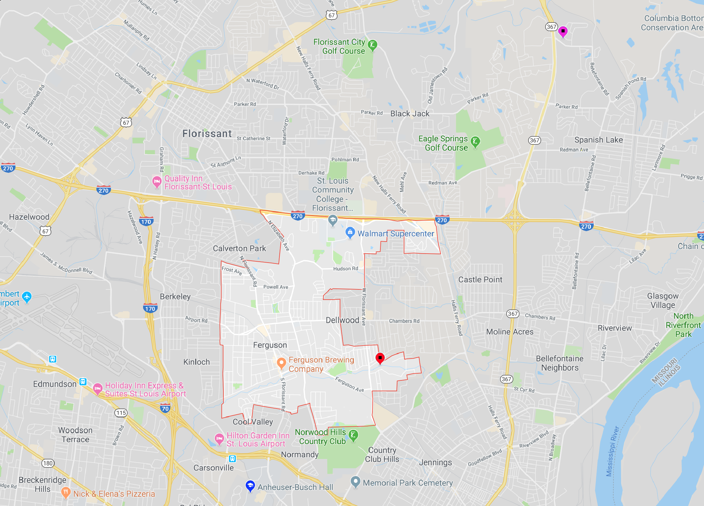
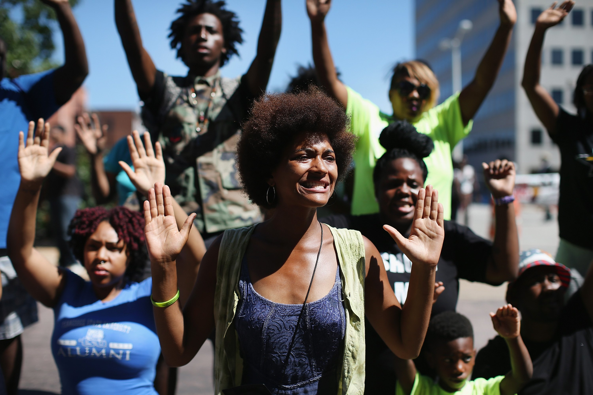
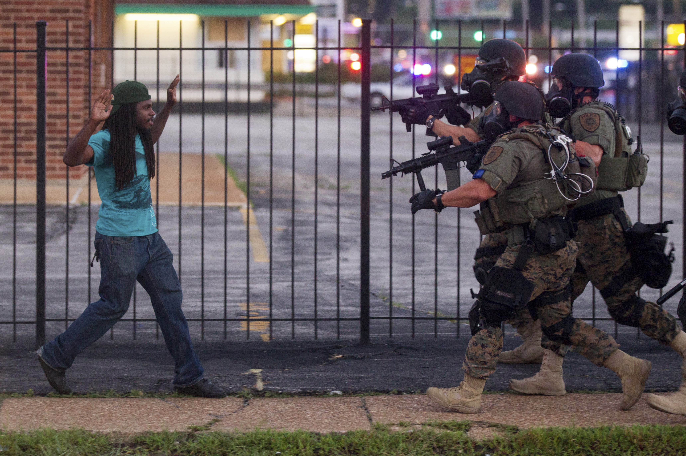
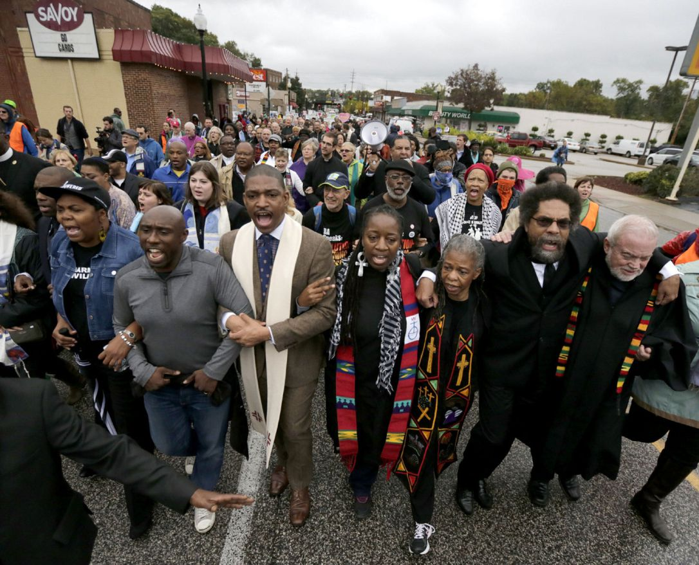
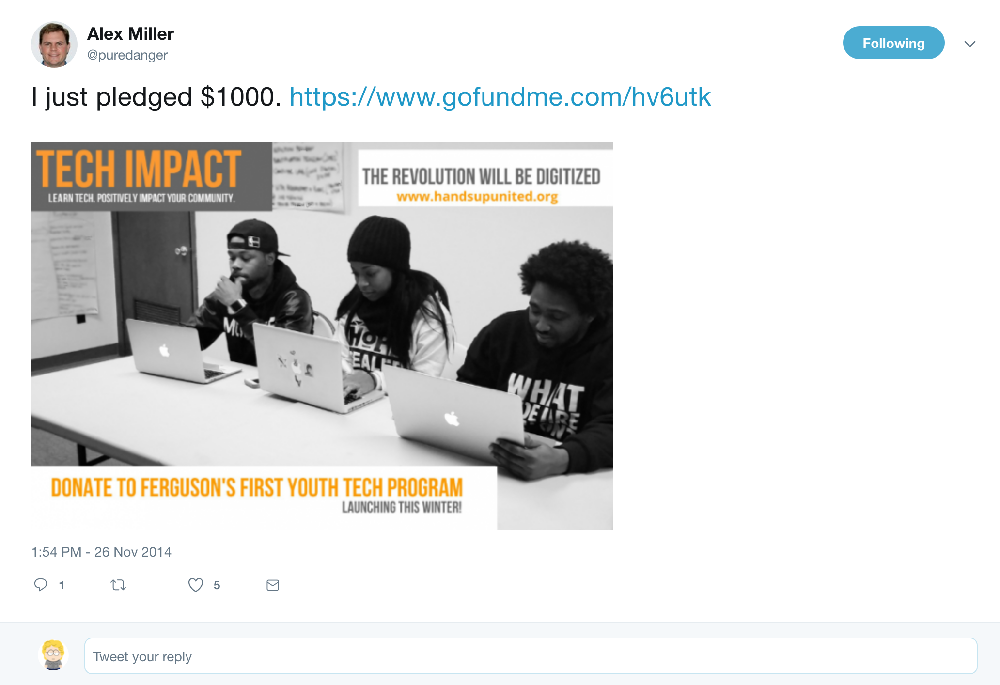
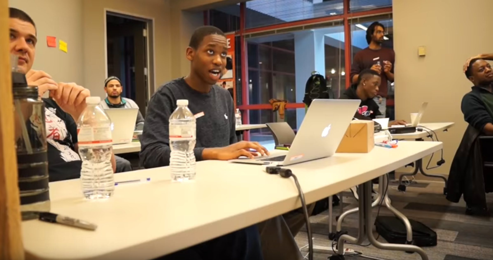

layout: true

<footer>
  
@CraigBuchek

  
craigbuchek.com/stldevfest-2019

</footer>

---
class: title, middle, center

# Community and Purpose

### Craig Buchek

---
class: single-image

???

* I was working on my talk for RubyConf 2014 when I saw this post
* I'd met Alex Harms at Ruby Midwest 2011

---
class: single-image

???

* I grew up a few miles from Ferguson, MO

----

* My parents' house, where I grew up - purple pin in northeast corner
* Mike Brown shooting - deep red pin in southeast corner of Ferguson

---
class: single-image

???

* The protests and violence were literally hitting close to home

---
class: single-image

???

* I was glued to the news for a couple weeks
    * TV and web at the same time
* I cried several times that first week
* I was sad
* I was angry
* I felt helpless

----

* I learned a lot
* The only difference between me and the rioters was that I was not oppressed
    * I was a part of the system that supported oppression
* So many people were hurting, feeling oppressed

---
class: single-image

???

* I marched in a couple protests
* But I didn't feel like I was really making an impact, or using my talents

---
class: single-image

???

* A week after RubyConf, I saw this
* Perfect:
    * It allowed me to apply my experience and skills
    * It felt like something that could make a difference
    * It was so compelling - a calling

---
class: single-image

???

* This is Cameron
* He was 14
* We were working on WordPress plugins
* We showed them a plugin to show sports scores
* He asked me how to show just his team

---
class: big-words

I don't know  
Let's find out

???

* My answer was "I don't know, let's find out"
* I told him to Google for "WordPress", the name of the plugin, and "one team"
* He clicked on the result, and it told him what to do

---
class: single-image

???

* At that moment, I saw the lightbulb go off in his head
* He went from near the bottom of the class to near the top
* He realized that he could **learn** the skills he needed

---
class: big-words

I don't know  
Let's find out

???

* Probably the 6 most powerful word I've ever spoken in my life
* It opened up a whole new world of possibilities for Cameron
* It's the most rewarding thing I've ever done
    * It probably changed my life more than his

---
class: big-words

Community

???

* We can see a great community here at RubyConf
* But don't forget the wider communities we live in
    * Your neighborhood, your city, your state, your country, your world

---
class: big-words

Community is where you can _find_ **purpose**

???

* Think about how to can give back to your communities
* Because it will give you back more than you give
